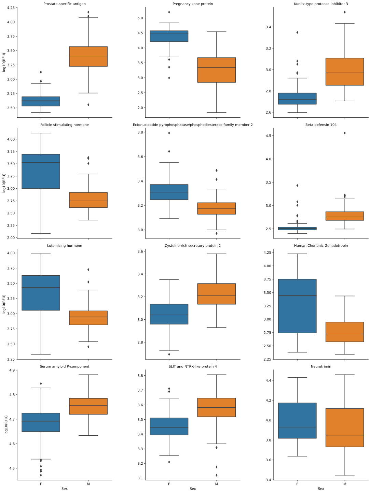
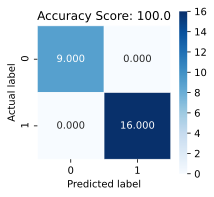
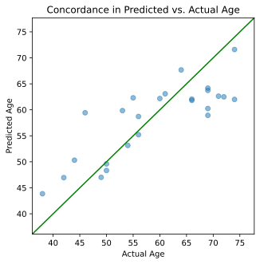

# The Python `Canopy` Package from Somalogic, Inc.


[](https://choosealicense.com/licenses/mit/)

-----

## Overview

This document accompanies the Python package `canopy`, which loads the SomaLogic, Inc. proprietary data file called an `*.adat`. The package provides auxiliary functions for extracting relevant information from the ADAT object once in the Python environment. Basic familiarity with the Python environment is assumed, as is the ability to install contributed packages from the Python Package Installer (pip)

-----

## Installation
The easiest way to install `Canopy` is to install directly from
GitHub:

``` bash
pip install git+https://github.com/SomaLogic/canopy.git#egg=canopy
```

Alternatively, if you wish to develop or change the source code, you may clone the repository and install manually via:

``` bash
git clone https://github.com/SomaLogic/canopy.git
pip install -e ./canopy
```

### Dependencies

`Python >3.8` is required to install `canopy`. The following package dependencies are installed on a `pip install`:
  - `pandas >= 1.1.0`
  - `numpy >= 1.19.1`


## Basics

Upon installation, load `canopy` as normal:


```python
import canopy
```

### For a traversable index of the library:


```python
help(canopy)
# help(canopy.adat) ... etc
```

*Output*
``` python
#> Help on package canopy:
#> 
#> NAME
#>     canopy
#> 
#> PACKAGE CONTENTS
#>     adat
#>     base (package)
#>     data (package)
#>     errors
#>     io (package)
#>     tools (package)
#> 
#> FILE
#>     /Users/jallison/Code/canopy/canopy/__init__.py
#> 
#> 
#> 
```

### Internal Objects

The `canopy` package comes with one internal object available to users to run canned examples (or analyses). It can be accessed by perform the import:

  - `from canopy.data.example_data import example_data`

## Main Features (I/O)

  - Loading data (Import)
      - Import a text file in the `*.adat` format into a `Python` session as an `adat` object.
  - Wrangling data (Manipulation)
      - Subset, reorder, and list various fields of an `adat` object.
  - Exporting data (Output)
      - Write out an `adat` object as a `*.adat` text file.

-----

### Loading an ADAT

Loading the sample file from within the canopy library via its path


```python
adat = canopy.read_file('./canopy/data/example_data.adat')
type(adat)
```


*Output*
``` python
#> canopy.adat.Adat
```


```python
adat.columns
```


*Output*
``` python
#> MultiIndex([( '10000-28', '3', 'SL019233', ...),
#>             (  '10001-7', '3', 'SL002564', ...),
#>             ( '10003-15', '3', 'SL019245', ...),
#>             ( '10006-25', '3', 'SL019228', ...),
#>             ( '10008-43', '3', 'SL019234', ...),
#>             ( '10011-65', '3', 'SL019246', ...),
#>             (  '10012-5', '3', 'SL014669', ...),
#>             ( '10013-34', '3', 'SL025418', ...),
#>             ( '10014-31', '3', 'SL007803', ...),
#>             ('10015-119', '3', 'SL014924', ...),
#>             ...
#>             (  '9981-18', '3', 'SL018293', ...),
#>             (  '9983-97', '3', 'SL019202', ...),
#>             (  '9984-12', '3', 'SL019205', ...),
#>             (  '9986-14', '3', 'SL005356', ...),
#>             (  '9989-12', '3', 'SL019194', ...),
#>             (  '9993-11', '3', 'SL019212', ...),
#>             ( '9994-217', '3', 'SL019217', ...),
#>             (   '9995-6', '3', 'SL013164', ...),
#>             (  '9997-12', '3', 'SL019215', ...),
#>             (   '9999-1', '3', 'SL019231', ...)],
#>            names=['SeqId', 'SeqIdVersion', 'SomaId', 'TargetFullName', 'Target', 'UniProt', 'EntrezGeneID', 'EntrezGeneSymbol', 'Organism', 'Units', 'Type', 'Dilution', 'PlateScale_Reference', 'CalReference', 'Cal_Example_Adat_Set001', 'ColCheck', 'CalQcRatio_Example_Adat_Set001_170255', 'QcReference_170255', 'Cal_Example_Adat_Set002', 'CalQcRatio_Example_Adat_Set002_170255'], length=5284)
```


```python
from IPython.display import HTML
#Display the first five rows and columns of the adat
HTML(adat.iloc[:5,:5].to_html()) # Need to use HTML & to_html() here to display nicely for this README
# Output is left-right scrollable in both this readme and Jupyter notebooks
```


*Output*
<table border="1" class="dataframe">
  <thead>
    <tr>
      <th></th>
      <th></th>
      <th></th>
      <th></th>
      <th></th>
      <th></th>
      <th></th>
      <th></th>
      <th></th>
      <th></th>
      <th></th>
      <th></th>
      <th></th>
      <th></th>
      <th></th>
      <th></th>
      <th></th>
      <th></th>
      <th></th>
      <th></th>
      <th></th>
      <th></th>
      <th></th>
      <th></th>
      <th></th>
      <th></th>
      <th></th>
      <th></th>
      <th></th>
      <th></th>
      <th></th>
      <th></th>
      <th></th>
      <th>SeqId</th>
      <th>10000-28</th>
      <th>10001-7</th>
      <th>10003-15</th>
      <th>10006-25</th>
      <th>10008-43</th>
    </tr>
    <tr>
      <th></th>
      <th></th>
      <th></th>
      <th></th>
      <th></th>
      <th></th>
      <th></th>
      <th></th>
      <th></th>
      <th></th>
      <th></th>
      <th></th>
      <th></th>
      <th></th>
      <th></th>
      <th></th>
      <th></th>
      <th></th>
      <th></th>
      <th></th>
      <th></th>
      <th></th>
      <th></th>
      <th></th>
      <th></th>
      <th></th>
      <th></th>
      <th></th>
      <th></th>
      <th></th>
      <th></th>
      <th></th>
      <th></th>
      <th>SeqIdVersion</th>
      <th>3</th>
      <th>3</th>
      <th>3</th>
      <th>3</th>
      <th>3</th>
    </tr>
    <tr>
      <th></th>
      <th></th>
      <th></th>
      <th></th>
      <th></th>
      <th></th>
      <th></th>
      <th></th>
      <th></th>
      <th></th>
      <th></th>
      <th></th>
      <th></th>
      <th></th>
      <th></th>
      <th></th>
      <th></th>
      <th></th>
      <th></th>
      <th></th>
      <th></th>
      <th></th>
      <th></th>
      <th></th>
      <th></th>
      <th></th>
      <th></th>
      <th></th>
      <th></th>
      <th></th>
      <th></th>
      <th></th>
      <th></th>
      <th>SomaId</th>
      <th>SL019233</th>
      <th>SL002564</th>
      <th>SL019245</th>
      <th>SL019228</th>
      <th>SL019234</th>
    </tr>
    <tr>
      <th></th>
      <th></th>
      <th></th>
      <th></th>
      <th></th>
      <th></th>
      <th></th>
      <th></th>
      <th></th>
      <th></th>
      <th></th>
      <th></th>
      <th></th>
      <th></th>
      <th></th>
      <th></th>
      <th></th>
      <th></th>
      <th></th>
      <th></th>
      <th></th>
      <th></th>
      <th></th>
      <th></th>
      <th></th>
      <th></th>
      <th></th>
      <th></th>
      <th></th>
      <th></th>
      <th></th>
      <th></th>
      <th></th>
      <th>TargetFullName</th>
      <th>Beta-crystallin B2</th>
      <th>RAF proto-oncogene serine/threonine-protein kinase</th>
      <th>Zinc finger protein 41</th>
      <th>ETS domain-containing protein Elk-1</th>
      <th>Guanylyl cyclase-activating protein 1</th>
    </tr>
    <tr>
      <th></th>
      <th></th>
      <th></th>
      <th></th>
      <th></th>
      <th></th>
      <th></th>
      <th></th>
      <th></th>
      <th></th>
      <th></th>
      <th></th>
      <th></th>
      <th></th>
      <th></th>
      <th></th>
      <th></th>
      <th></th>
      <th></th>
      <th></th>
      <th></th>
      <th></th>
      <th></th>
      <th></th>
      <th></th>
      <th></th>
      <th></th>
      <th></th>
      <th></th>
      <th></th>
      <th></th>
      <th></th>
      <th></th>
      <th>Target</th>
      <th>CRBB2</th>
      <th>c-Raf</th>
      <th>ZNF41</th>
      <th>ELK1</th>
      <th>GUC1A</th>
    </tr>
    <tr>
      <th></th>
      <th></th>
      <th></th>
      <th></th>
      <th></th>
      <th></th>
      <th></th>
      <th></th>
      <th></th>
      <th></th>
      <th></th>
      <th></th>
      <th></th>
      <th></th>
      <th></th>
      <th></th>
      <th></th>
      <th></th>
      <th></th>
      <th></th>
      <th></th>
      <th></th>
      <th></th>
      <th></th>
      <th></th>
      <th></th>
      <th></th>
      <th></th>
      <th></th>
      <th></th>
      <th></th>
      <th></th>
      <th></th>
      <th>UniProt</th>
      <th>P43320</th>
      <th>P04049</th>
      <th>P51814</th>
      <th>P19419</th>
      <th>P43080</th>
    </tr>
    <tr>
      <th></th>
      <th></th>
      <th></th>
      <th></th>
      <th></th>
      <th></th>
      <th></th>
      <th></th>
      <th></th>
      <th></th>
      <th></th>
      <th></th>
      <th></th>
      <th></th>
      <th></th>
      <th></th>
      <th></th>
      <th></th>
      <th></th>
      <th></th>
      <th></th>
      <th></th>
      <th></th>
      <th></th>
      <th></th>
      <th></th>
      <th></th>
      <th></th>
      <th></th>
      <th></th>
      <th></th>
      <th></th>
      <th></th>
      <th>EntrezGeneID</th>
      <th>1415</th>
      <th>5894</th>
      <th>7592</th>
      <th>2002</th>
      <th>2978</th>
    </tr>
    <tr>
      <th></th>
      <th></th>
      <th></th>
      <th></th>
      <th></th>
      <th></th>
      <th></th>
      <th></th>
      <th></th>
      <th></th>
      <th></th>
      <th></th>
      <th></th>
      <th></th>
      <th></th>
      <th></th>
      <th></th>
      <th></th>
      <th></th>
      <th></th>
      <th></th>
      <th></th>
      <th></th>
      <th></th>
      <th></th>
      <th></th>
      <th></th>
      <th></th>
      <th></th>
      <th></th>
      <th></th>
      <th></th>
      <th></th>
      <th>EntrezGeneSymbol</th>
      <th>CRYBB2</th>
      <th>RAF1</th>
      <th>ZNF41</th>
      <th>ELK1</th>
      <th>GUCA1A</th>
    </tr>
    <tr>
      <th></th>
      <th></th>
      <th></th>
      <th></th>
      <th></th>
      <th></th>
      <th></th>
      <th></th>
      <th></th>
      <th></th>
      <th></th>
      <th></th>
      <th></th>
      <th></th>
      <th></th>
      <th></th>
      <th></th>
      <th></th>
      <th></th>
      <th></th>
      <th></th>
      <th></th>
      <th></th>
      <th></th>
      <th></th>
      <th></th>
      <th></th>
      <th></th>
      <th></th>
      <th></th>
      <th></th>
      <th></th>
      <th></th>
      <th>Organism</th>
      <th>Human</th>
      <th>Human</th>
      <th>Human</th>
      <th>Human</th>
      <th>Human</th>
    </tr>
    <tr>
      <th></th>
      <th></th>
      <th></th>
      <th></th>
      <th></th>
      <th></th>
      <th></th>
      <th></th>
      <th></th>
      <th></th>
      <th></th>
      <th></th>
      <th></th>
      <th></th>
      <th></th>
      <th></th>
      <th></th>
      <th></th>
      <th></th>
      <th></th>
      <th></th>
      <th></th>
      <th></th>
      <th></th>
      <th></th>
      <th></th>
      <th></th>
      <th></th>
      <th></th>
      <th></th>
      <th></th>
      <th></th>
      <th></th>
      <th>Units</th>
      <th>RFU</th>
      <th>RFU</th>
      <th>RFU</th>
      <th>RFU</th>
      <th>RFU</th>
    </tr>
    <tr>
      <th></th>
      <th></th>
      <th></th>
      <th></th>
      <th></th>
      <th></th>
      <th></th>
      <th></th>
      <th></th>
      <th></th>
      <th></th>
      <th></th>
      <th></th>
      <th></th>
      <th></th>
      <th></th>
      <th></th>
      <th></th>
      <th></th>
      <th></th>
      <th></th>
      <th></th>
      <th></th>
      <th></th>
      <th></th>
      <th></th>
      <th></th>
      <th></th>
      <th></th>
      <th></th>
      <th></th>
      <th></th>
      <th></th>
      <th>Type</th>
      <th>Protein</th>
      <th>Protein</th>
      <th>Protein</th>
      <th>Protein</th>
      <th>Protein</th>
    </tr>
    <tr>
      <th></th>
      <th></th>
      <th></th>
      <th></th>
      <th></th>
      <th></th>
      <th></th>
      <th></th>
      <th></th>
      <th></th>
      <th></th>
      <th></th>
      <th></th>
      <th></th>
      <th></th>
      <th></th>
      <th></th>
      <th></th>
      <th></th>
      <th></th>
      <th></th>
      <th></th>
      <th></th>
      <th></th>
      <th></th>
      <th></th>
      <th></th>
      <th></th>
      <th></th>
      <th></th>
      <th></th>
      <th></th>
      <th></th>
      <th>Dilution</th>
      <th>20</th>
      <th>20</th>
      <th>0.5</th>
      <th>20</th>
      <th>20</th>
    </tr>
    <tr>
      <th></th>
      <th></th>
      <th></th>
      <th></th>
      <th></th>
      <th></th>
      <th></th>
      <th></th>
      <th></th>
      <th></th>
      <th></th>
      <th></th>
      <th></th>
      <th></th>
      <th></th>
      <th></th>
      <th></th>
      <th></th>
      <th></th>
      <th></th>
      <th></th>
      <th></th>
      <th></th>
      <th></th>
      <th></th>
      <th></th>
      <th></th>
      <th></th>
      <th></th>
      <th></th>
      <th></th>
      <th></th>
      <th></th>
      <th>PlateScale_Reference</th>
      <th>687.4</th>
      <th>227.8</th>
      <th>126.9</th>
      <th>634.2</th>
      <th>585.0</th>
    </tr>
    <tr>
      <th></th>
      <th></th>
      <th></th>
      <th></th>
      <th></th>
      <th></th>
      <th></th>
      <th></th>
      <th></th>
      <th></th>
      <th></th>
      <th></th>
      <th></th>
      <th></th>
      <th></th>
      <th></th>
      <th></th>
      <th></th>
      <th></th>
      <th></th>
      <th></th>
      <th></th>
      <th></th>
      <th></th>
      <th></th>
      <th></th>
      <th></th>
      <th></th>
      <th></th>
      <th></th>
      <th></th>
      <th></th>
      <th></th>
      <th>CalReference</th>
      <th>687.4</th>
      <th>227.8</th>
      <th>126.9</th>
      <th>634.2</th>
      <th>585.0</th>
    </tr>
    <tr>
      <th></th>
      <th></th>
      <th></th>
      <th></th>
      <th></th>
      <th></th>
      <th></th>
      <th></th>
      <th></th>
      <th></th>
      <th></th>
      <th></th>
      <th></th>
      <th></th>
      <th></th>
      <th></th>
      <th></th>
      <th></th>
      <th></th>
      <th></th>
      <th></th>
      <th></th>
      <th></th>
      <th></th>
      <th></th>
      <th></th>
      <th></th>
      <th></th>
      <th></th>
      <th></th>
      <th></th>
      <th></th>
      <th></th>
      <th>Cal_Example_Adat_Set001</th>
      <th>1.01252025</th>
      <th>1.01605709</th>
      <th>0.95056180</th>
      <th>0.99607350</th>
      <th>0.94051447</th>
    </tr>
    <tr>
      <th></th>
      <th></th>
      <th></th>
      <th></th>
      <th></th>
      <th></th>
      <th></th>
      <th></th>
      <th></th>
      <th></th>
      <th></th>
      <th></th>
      <th></th>
      <th></th>
      <th></th>
      <th></th>
      <th></th>
      <th></th>
      <th></th>
      <th></th>
      <th></th>
      <th></th>
      <th></th>
      <th></th>
      <th></th>
      <th></th>
      <th></th>
      <th></th>
      <th></th>
      <th></th>
      <th></th>
      <th></th>
      <th></th>
      <th>ColCheck</th>
      <th>PASS</th>
      <th>PASS</th>
      <th>PASS</th>
      <th>PASS</th>
      <th>PASS</th>
    </tr>
    <tr>
      <th></th>
      <th></th>
      <th></th>
      <th></th>
      <th></th>
      <th></th>
      <th></th>
      <th></th>
      <th></th>
      <th></th>
      <th></th>
      <th></th>
      <th></th>
      <th></th>
      <th></th>
      <th></th>
      <th></th>
      <th></th>
      <th></th>
      <th></th>
      <th></th>
      <th></th>
      <th></th>
      <th></th>
      <th></th>
      <th></th>
      <th></th>
      <th></th>
      <th></th>
      <th></th>
      <th></th>
      <th></th>
      <th></th>
      <th>CalQcRatio_Example_Adat_Set001_170255</th>
      <th>1.008</th>
      <th>0.970</th>
      <th>1.046</th>
      <th>1.042</th>
      <th>1.036</th>
    </tr>
    <tr>
      <th></th>
      <th></th>
      <th></th>
      <th></th>
      <th></th>
      <th></th>
      <th></th>
      <th></th>
      <th></th>
      <th></th>
      <th></th>
      <th></th>
      <th></th>
      <th></th>
      <th></th>
      <th></th>
      <th></th>
      <th></th>
      <th></th>
      <th></th>
      <th></th>
      <th></th>
      <th></th>
      <th></th>
      <th></th>
      <th></th>
      <th></th>
      <th></th>
      <th></th>
      <th></th>
      <th></th>
      <th></th>
      <th></th>
      <th>QcReference_170255</th>
      <th>505.4</th>
      <th>223.9</th>
      <th>119.6</th>
      <th>667.2</th>
      <th>587.5</th>
    </tr>
    <tr>
      <th></th>
      <th></th>
      <th></th>
      <th></th>
      <th></th>
      <th></th>
      <th></th>
      <th></th>
      <th></th>
      <th></th>
      <th></th>
      <th></th>
      <th></th>
      <th></th>
      <th></th>
      <th></th>
      <th></th>
      <th></th>
      <th></th>
      <th></th>
      <th></th>
      <th></th>
      <th></th>
      <th></th>
      <th></th>
      <th></th>
      <th></th>
      <th></th>
      <th></th>
      <th></th>
      <th></th>
      <th></th>
      <th></th>
      <th>Cal_Example_Adat_Set002</th>
      <th>1.01476233</th>
      <th>1.03686846</th>
      <th>1.15258856</th>
      <th>0.93581231</th>
      <th>0.96201283</th>
    </tr>
    <tr>
      <th></th>
      <th></th>
      <th></th>
      <th></th>
      <th></th>
      <th></th>
      <th></th>
      <th></th>
      <th></th>
      <th></th>
      <th></th>
      <th></th>
      <th></th>
      <th></th>
      <th></th>
      <th></th>
      <th></th>
      <th></th>
      <th></th>
      <th></th>
      <th></th>
      <th></th>
      <th></th>
      <th></th>
      <th></th>
      <th></th>
      <th></th>
      <th></th>
      <th></th>
      <th></th>
      <th></th>
      <th></th>
      <th></th>
      <th>CalQcRatio_Example_Adat_Set002_170255</th>
      <th>1.067</th>
      <th>1.007</th>
      <th>0.981</th>
      <th>1.026</th>
      <th>0.998</th>
    </tr>
    <tr>
      <th>PlateId</th>
      <th>PlateRunDate</th>
      <th>ScannerID</th>
      <th>PlatePosition</th>
      <th>SlideId</th>
      <th>Subarray</th>
      <th>SampleId</th>
      <th>SampleType</th>
      <th>PercentDilution</th>
      <th>SampleMatrix</th>
      <th>Barcode</th>
      <th>Barcode2d</th>
      <th>SampleName</th>
      <th>SampleNotes</th>
      <th>AliquotingNotes</th>
      <th>SampleDescription</th>
      <th>AssayNotes</th>
      <th>TimePoint</th>
      <th>ExtIdentifier</th>
      <th>SsfExtId</th>
      <th>SampleGroup</th>
      <th>SiteId</th>
      <th>TubeUniqueID</th>
      <th>CLI</th>
      <th>HybControlNormScale</th>
      <th>RowCheck</th>
      <th>NormScale_20</th>
      <th>NormScale_0_005</th>
      <th>NormScale_0_5</th>
      <th>ANMLFractionUsed_20</th>
      <th>ANMLFractionUsed_0_005</th>
      <th>ANMLFractionUsed_0_5</th>
      <th>Age</th>
      <th>Sex</th>
      <th></th>
      <th></th>
      <th></th>
      <th></th>
      <th></th>
    </tr>
  </thead>
  <tbody>
    <tr>
      <th rowspan="5" valign="top">Example Adat Set001</th>
      <th rowspan="5" valign="top">2020-06-18</th>
      <th rowspan="5" valign="top">SG15214400</th>
      <th>H9</th>
      <th>258495800012</th>
      <th>3</th>
      <th>1</th>
      <th>Sample</th>
      <th>20</th>
      <th>Plasma-PPT</th>
      <th></th>
      <th></th>
      <th></th>
      <th></th>
      <th></th>
      <th></th>
      <th></th>
      <th></th>
      <th></th>
      <th></th>
      <th></th>
      <th></th>
      <th></th>
      <th></th>
      <th>0.98185998</th>
      <th>PASS</th>
      <th>1.03693580</th>
      <th>0.85701624</th>
      <th>0.77717491</th>
      <th>0.914</th>
      <th>0.869</th>
      <th>0.903</th>
      <th>76</th>
      <th>F</th>
      <td>476.5</td>
      <td>310.1</td>
      <td>100.3</td>
      <td>602.8</td>
      <td>561.8</td>
    </tr>
    <tr>
      <th>H8</th>
      <th>258495800004</th>
      <th>7</th>
      <th>2</th>
      <th>Sample</th>
      <th>20</th>
      <th>Plasma-PPT</th>
      <th></th>
      <th></th>
      <th></th>
      <th></th>
      <th></th>
      <th></th>
      <th></th>
      <th></th>
      <th></th>
      <th></th>
      <th></th>
      <th></th>
      <th></th>
      <th></th>
      <th>0.96671829</th>
      <th>PASS</th>
      <th>0.96022505</th>
      <th>0.84858420</th>
      <th>0.85201953</th>
      <th>0.937</th>
      <th>0.956</th>
      <th>0.973</th>
      <th>55</th>
      <th>F</th>
      <td>474.4</td>
      <td>293.5</td>
      <td>101.8</td>
      <td>561.9</td>
      <td>541.9</td>
    </tr>
    <tr>
      <th>H7</th>
      <th>258495800010</th>
      <th>8</th>
      <th>3</th>
      <th>Sample</th>
      <th>20</th>
      <th>Plasma-PPT</th>
      <th></th>
      <th></th>
      <th></th>
      <th></th>
      <th></th>
      <th></th>
      <th></th>
      <th></th>
      <th></th>
      <th></th>
      <th></th>
      <th></th>
      <th></th>
      <th></th>
      <th>1.00193072</th>
      <th>PASS</th>
      <th>0.98411617</th>
      <th>1.03270156</th>
      <th>0.91519153</th>
      <th>0.907</th>
      <th>0.919</th>
      <th>0.915</th>
      <th>47</th>
      <th>M</th>
      <td>415.6</td>
      <td>299.6</td>
      <td>3030.1</td>
      <td>563.9</td>
      <td>423.9</td>
    </tr>
    <tr>
      <th>H6</th>
      <th>258495800003</th>
      <th>4</th>
      <th>4</th>
      <th>Sample</th>
      <th>20</th>
      <th>Plasma-PPT</th>
      <th></th>
      <th></th>
      <th></th>
      <th></th>
      <th></th>
      <th></th>
      <th></th>
      <th></th>
      <th></th>
      <th></th>
      <th></th>
      <th></th>
      <th></th>
      <th></th>
      <th>0.94017961</th>
      <th>PASS</th>
      <th>1.07839878</th>
      <th>0.94626841</th>
      <th>0.91246731</th>
      <th>0.934</th>
      <th>0.919</th>
      <th>0.912</th>
      <th>37</th>
      <th>M</th>
      <td>442.6</td>
      <td>247.9</td>
      <td>112.9</td>
      <td>563.7</td>
      <td>469.8</td>
    </tr>
    <tr>
      <th>H5</th>
      <th>258495800009</th>
      <th>4</th>
      <th>5</th>
      <th>Sample</th>
      <th>20</th>
      <th>Plasma-PPT</th>
      <th></th>
      <th></th>
      <th></th>
      <th></th>
      <th></th>
      <th></th>
      <th></th>
      <th></th>
      <th></th>
      <th></th>
      <th></th>
      <th></th>
      <th></th>
      <th></th>
      <th>0.94621098</th>
      <th>PASS</th>
      <th>0.84679446</th>
      <th>0.92904553</th>
      <th>0.77413056</th>
      <th>0.707</th>
      <th>0.894</th>
      <th>0.708</th>
      <th>71</th>
      <th>F</th>
      <td>465.7</td>
      <td>710.7</td>
      <td>95.9</td>
      <td>791.0</td>
      <td>443.5</td>
    </tr>
  </tbody>
</table>


You may also access the dict header metadata via:


```python
adat.header_metadata
```


*Output*
``` python
#> {'!AdatId': 'GID-1234-56-789-abcdef',
#>  '!Version': '1.2',
#>  '!AssayType': 'PharmaServices',
#>  '!AssayVersion': 'V4',
#>  '!AssayRobot': 'Fluent 1 L-307',
#>  '!Legal': 'Experiment details and data have been processed to protect Personally Identifiable Information (PII) and comply with existing privacy laws.',
#>  '!CreatedBy': 'PharmaServices',
#>  '!CreatedDate': '2020-07-24',
#>  '!EnteredBy': 'Technician1',
#>  '!ExpDate': '2020-06-18, 2020-07-20',
#>  '!GeneratedBy': 'Px (Build:  : ), Canopy_0.1.1',
#>  '!RunNotes': "2 columns ('Age' and 'Sex') have been added to this ADAT. Age has been randomly increased or decreased by 1-2 years to protect patient information",
#>  '!ProcessSteps': 'Raw RFU, Hyb Normalization, medNormInt (SampleId), plateScale, Calibration, anmlQC, qcCheck, anmlSMP',
#>  '!ProteinEffectiveDate': '2019-08-06',
#>  '!StudyMatrix': 'EDTA Plasma',
#>  '!PlateType': '',
#>  '!LabLocation': 'SLUS',
#>  '!StudyOrganism': '',
#>  '!Title': 'Example Adat Set001, Example Adat Set002',
#>  '!AssaySite': 'SW',
#>  '!CalibratorId': '170261',
#>  '!ReportConfig': {'analysisSteps': [{'stepType': 'hybNorm',
#>     'referenceSource': 'intraplate',
#>     'includeSampleTypes': ['QC', 'Calibrator', 'Buffer']},
#>    {'stepName': 'medNormInt',
#>     'stepType': 'medNorm',
#>     'includeSampleTypes': ['Calibrator', 'Buffer'],
#>     'referenceSource': 'intraplate',
#>     'referenceFields': ['SampleId']},
#>    {'stepType': 'plateScale',
#>     'referenceSource': 'Reference_v4_Plasma_Calibrator_170261'},
#>    {'stepType': 'calibrate',
#>     'referenceSource': 'Reference_v4_Plasma_Calibrator_170261'},
#>    {'stepName': 'anmlQC',
#>     'stepType': 'ANML',
#>     'effectSizeCutoff': 2.0,
#>     'minFractionUsed': 0.3,
#>     'includeSampleTypes': ['QC'],
#>     'referenceSource': 'Reference_v4_Plasma_ANML'},
#>    {'stepType': 'qcCheck',
#>     'QCReferenceSource': 'Reference_v4_Plasma_QC_ANML_170255',
#>     'tailsCriteriaLower': 0.8,
#>     'tailsCriteriaUpper': 1.2,
#>     'tailThreshold': 15.0,
#>     'QCAdditionalReferenceSources': ['Reference_v4_Plasma_QC_ANML_170259',
#>      'Reference_v4_Plasma_QC_ANML_170260'],
#>     'prenormalized': True},
#>    {'stepName': 'anmlSMP',
#>     'stepType': 'ANML',
#>     'effectSizeCutoff': 2.0,
#>     'minFractionUsed': 0.3,
#>     'includeSampleTypes': ['Sample'],
#>     'referenceSource': 'Reference_v4_Plasma_ANML'}],
#>   'qualityReports': ['SQS Report'],
#>   'filter': {'proteinEffectiveDate': '2019-08-06'}},
#>  'HybNormReference': 'intraplate',
#>  'MedNormReference': 'intraplate',
#>  'NormalizationAlgorithm': 'ANML',
#>  'PlateScale_ReferenceSource': 'Reference_v4_Plasma_Calibrator_170261',
#>  'PlateScale_Scalar_Example_Adat_Set001': '1.08091554',
#>  'PlateScale_PassFlag_Example_Adat_Set001': 'PASS',
#>  'CalibrationReference': 'Reference_v4_Plasma_Calibrator_170261',
#>  'CalPlateTailPercent_Example_Adat_Set001': '0.1',
#>  'PlateTailPercent_Example_Adat_Set001': '1.2',
#>  'PlateTailTest_Example_Adat_Set001': 'PASS',
#>  'PlateScale_Scalar_Example_Adat_Set002': '1.09915270',
#>  'PlateScale_PassFlag_Example_Adat_Set002': 'PASS',
#>  'CalPlateTailPercent_Example_Adat_Set002': '2.6',
#>  'PlateTailPercent_Example_Adat_Set002': '4.2',
#>  'PlateTailTest_Example_Adat_Set002': 'PASS'}
```


Canopy's Adat object inherits the pandas printing methods which displays nicely in Jupyter Notebooks when using `IPython.display.display()`.

### Wrangling
Dataframe `columns` Contain Feature Information


```python
# Using the `adat` loaded from above
aptamer_df = adat.columns.to_frame(index=False)
type(aptamer_df)
```


*Output*
``` python
#> pandas.core.frame.DataFrame
```


```python
HTML(aptamer_df.head(5).to_html())
```


*Output*
<table border="1" class="dataframe">
  <thead>
    <tr style="text-align: right;">
      <th></th>
      <th>SeqId</th>
      <th>SeqIdVersion</th>
      <th>SomaId</th>
      <th>TargetFullName</th>
      <th>Target</th>
      <th>UniProt</th>
      <th>EntrezGeneID</th>
      <th>EntrezGeneSymbol</th>
      <th>Organism</th>
      <th>Units</th>
      <th>Type</th>
      <th>Dilution</th>
      <th>PlateScale_Reference</th>
      <th>CalReference</th>
      <th>Cal_Example_Adat_Set001</th>
      <th>ColCheck</th>
      <th>CalQcRatio_Example_Adat_Set001_170255</th>
      <th>QcReference_170255</th>
      <th>Cal_Example_Adat_Set002</th>
      <th>CalQcRatio_Example_Adat_Set002_170255</th>
    </tr>
  </thead>
  <tbody>
    <tr>
      <th>0</th>
      <td>10000-28</td>
      <td>3</td>
      <td>SL019233</td>
      <td>Beta-crystallin B2</td>
      <td>CRBB2</td>
      <td>P43320</td>
      <td>1415</td>
      <td>CRYBB2</td>
      <td>Human</td>
      <td>RFU</td>
      <td>Protein</td>
      <td>20</td>
      <td>687.4</td>
      <td>687.4</td>
      <td>1.01252025</td>
      <td>PASS</td>
      <td>1.008</td>
      <td>505.4</td>
      <td>1.01476233</td>
      <td>1.067</td>
    </tr>
    <tr>
      <th>1</th>
      <td>10001-7</td>
      <td>3</td>
      <td>SL002564</td>
      <td>RAF proto-oncogene serine/threonine-protein kinase</td>
      <td>c-Raf</td>
      <td>P04049</td>
      <td>5894</td>
      <td>RAF1</td>
      <td>Human</td>
      <td>RFU</td>
      <td>Protein</td>
      <td>20</td>
      <td>227.8</td>
      <td>227.8</td>
      <td>1.01605709</td>
      <td>PASS</td>
      <td>0.970</td>
      <td>223.9</td>
      <td>1.03686846</td>
      <td>1.007</td>
    </tr>
    <tr>
      <th>2</th>
      <td>10003-15</td>
      <td>3</td>
      <td>SL019245</td>
      <td>Zinc finger protein 41</td>
      <td>ZNF41</td>
      <td>P51814</td>
      <td>7592</td>
      <td>ZNF41</td>
      <td>Human</td>
      <td>RFU</td>
      <td>Protein</td>
      <td>0.5</td>
      <td>126.9</td>
      <td>126.9</td>
      <td>0.95056180</td>
      <td>PASS</td>
      <td>1.046</td>
      <td>119.6</td>
      <td>1.15258856</td>
      <td>0.981</td>
    </tr>
    <tr>
      <th>3</th>
      <td>10006-25</td>
      <td>3</td>
      <td>SL019228</td>
      <td>ETS domain-containing protein Elk-1</td>
      <td>ELK1</td>
      <td>P19419</td>
      <td>2002</td>
      <td>ELK1</td>
      <td>Human</td>
      <td>RFU</td>
      <td>Protein</td>
      <td>20</td>
      <td>634.2</td>
      <td>634.2</td>
      <td>0.99607350</td>
      <td>PASS</td>
      <td>1.042</td>
      <td>667.2</td>
      <td>0.93581231</td>
      <td>1.026</td>
    </tr>
    <tr>
      <th>4</th>
      <td>10008-43</td>
      <td>3</td>
      <td>SL019234</td>
      <td>Guanylyl cyclase-activating protein 1</td>
      <td>GUC1A</td>
      <td>P43080</td>
      <td>2978</td>
      <td>GUCA1A</td>
      <td>Human</td>
      <td>RFU</td>
      <td>Protein</td>
      <td>20</td>
      <td>585.0</td>
      <td>585.0</td>
      <td>0.94051447</td>
      <td>PASS</td>
      <td>1.036</td>
      <td>587.5</td>
      <td>0.96201283</td>
      <td>0.998</td>
    </tr>
  </tbody>
</table>


### Accessing feature data

The `.to_frame()` method creates a lookup table that links the feature names in the `adat` object to the annotation data in `columns`:


```python
col_df = adat.columns.to_frame(index=False)
type(col_df)
```


*Output*
``` python
#> pandas.core.frame.DataFrame
```


```python
HTML(col_df.head(5).to_html())
```


*Output*
<table border="1" class="dataframe">
  <thead>
    <tr style="text-align: right;">
      <th></th>
      <th>SeqId</th>
      <th>SeqIdVersion</th>
      <th>SomaId</th>
      <th>TargetFullName</th>
      <th>Target</th>
      <th>UniProt</th>
      <th>EntrezGeneID</th>
      <th>EntrezGeneSymbol</th>
      <th>Organism</th>
      <th>Units</th>
      <th>Type</th>
      <th>Dilution</th>
      <th>PlateScale_Reference</th>
      <th>CalReference</th>
      <th>Cal_Example_Adat_Set001</th>
      <th>ColCheck</th>
      <th>CalQcRatio_Example_Adat_Set001_170255</th>
      <th>QcReference_170255</th>
      <th>Cal_Example_Adat_Set002</th>
      <th>CalQcRatio_Example_Adat_Set002_170255</th>
    </tr>
  </thead>
  <tbody>
    <tr>
      <th>0</th>
      <td>10000-28</td>
      <td>3</td>
      <td>SL019233</td>
      <td>Beta-crystallin B2</td>
      <td>CRBB2</td>
      <td>P43320</td>
      <td>1415</td>
      <td>CRYBB2</td>
      <td>Human</td>
      <td>RFU</td>
      <td>Protein</td>
      <td>20</td>
      <td>687.4</td>
      <td>687.4</td>
      <td>1.01252025</td>
      <td>PASS</td>
      <td>1.008</td>
      <td>505.4</td>
      <td>1.01476233</td>
      <td>1.067</td>
    </tr>
    <tr>
      <th>1</th>
      <td>10001-7</td>
      <td>3</td>
      <td>SL002564</td>
      <td>RAF proto-oncogene serine/threonine-protein kinase</td>
      <td>c-Raf</td>
      <td>P04049</td>
      <td>5894</td>
      <td>RAF1</td>
      <td>Human</td>
      <td>RFU</td>
      <td>Protein</td>
      <td>20</td>
      <td>227.8</td>
      <td>227.8</td>
      <td>1.01605709</td>
      <td>PASS</td>
      <td>0.970</td>
      <td>223.9</td>
      <td>1.03686846</td>
      <td>1.007</td>
    </tr>
    <tr>
      <th>2</th>
      <td>10003-15</td>
      <td>3</td>
      <td>SL019245</td>
      <td>Zinc finger protein 41</td>
      <td>ZNF41</td>
      <td>P51814</td>
      <td>7592</td>
      <td>ZNF41</td>
      <td>Human</td>
      <td>RFU</td>
      <td>Protein</td>
      <td>0.5</td>
      <td>126.9</td>
      <td>126.9</td>
      <td>0.95056180</td>
      <td>PASS</td>
      <td>1.046</td>
      <td>119.6</td>
      <td>1.15258856</td>
      <td>0.981</td>
    </tr>
    <tr>
      <th>3</th>
      <td>10006-25</td>
      <td>3</td>
      <td>SL019228</td>
      <td>ETS domain-containing protein Elk-1</td>
      <td>ELK1</td>
      <td>P19419</td>
      <td>2002</td>
      <td>ELK1</td>
      <td>Human</td>
      <td>RFU</td>
      <td>Protein</td>
      <td>20</td>
      <td>634.2</td>
      <td>634.2</td>
      <td>0.99607350</td>
      <td>PASS</td>
      <td>1.042</td>
      <td>667.2</td>
      <td>0.93581231</td>
      <td>1.026</td>
    </tr>
    <tr>
      <th>4</th>
      <td>10008-43</td>
      <td>3</td>
      <td>SL019234</td>
      <td>Guanylyl cyclase-activating protein 1</td>
      <td>GUC1A</td>
      <td>P43080</td>
      <td>2978</td>
      <td>GUCA1A</td>
      <td>Human</td>
      <td>RFU</td>
      <td>Protein</td>
      <td>20</td>
      <td>585.0</td>
      <td>585.0</td>
      <td>0.94051447</td>
      <td>PASS</td>
      <td>1.036</td>
      <td>587.5</td>
      <td>0.96201283</td>
      <td>0.998</td>
    </tr>
  </tbody>
</table>


### Display features


```python
adat.columns.get_level_values('SeqId')[:20] # first 20 features
```


*Output*
``` python
#> Index(['10000-28', '10001-7', '10003-15', '10006-25', '10008-43', '10011-65',
#>        '10012-5', '10013-34', '10014-31', '10015-119', '10021-1', '10022-207',
#>        '10023-32', '10024-44', '10030-8', '10034-16', '10035-6', '10036-201',
#>        '10037-98', '10040-63'],
#>       dtype='object', name='SeqId')
```


### Get # Features


```python
adat.shape[1]
```


*Output*
``` python
#> 5284
```


### Clinical Data

Dataframe `index` Contains Sample Information


```python
# Using the `adat` loaded from above
sample_df = adat.index.to_frame(index=False)
type(sample_df)
```


*Output*
``` python
#> pandas.core.frame.DataFrame
```


```python
HTML(sample_df.head(5).to_html())
```


*Output*
<table border="1" class="dataframe">
  <thead>
    <tr style="text-align: right;">
      <th></th>
      <th>PlateId</th>
      <th>PlateRunDate</th>
      <th>ScannerID</th>
      <th>PlatePosition</th>
      <th>SlideId</th>
      <th>Subarray</th>
      <th>SampleId</th>
      <th>SampleType</th>
      <th>PercentDilution</th>
      <th>SampleMatrix</th>
      <th>Barcode</th>
      <th>Barcode2d</th>
      <th>SampleName</th>
      <th>SampleNotes</th>
      <th>AliquotingNotes</th>
      <th>SampleDescription</th>
      <th>AssayNotes</th>
      <th>TimePoint</th>
      <th>ExtIdentifier</th>
      <th>SsfExtId</th>
      <th>SampleGroup</th>
      <th>SiteId</th>
      <th>TubeUniqueID</th>
      <th>CLI</th>
      <th>HybControlNormScale</th>
      <th>RowCheck</th>
      <th>NormScale_20</th>
      <th>NormScale_0_005</th>
      <th>NormScale_0_5</th>
      <th>ANMLFractionUsed_20</th>
      <th>ANMLFractionUsed_0_005</th>
      <th>ANMLFractionUsed_0_5</th>
      <th>Age</th>
      <th>Sex</th>
    </tr>
  </thead>
  <tbody>
    <tr>
      <th>0</th>
      <td>Example Adat Set001</td>
      <td>2020-06-18</td>
      <td>SG15214400</td>
      <td>H9</td>
      <td>258495800012</td>
      <td>3</td>
      <td>1</td>
      <td>Sample</td>
      <td>20</td>
      <td>Plasma-PPT</td>
      <td></td>
      <td></td>
      <td></td>
      <td></td>
      <td></td>
      <td></td>
      <td></td>
      <td></td>
      <td></td>
      <td></td>
      <td></td>
      <td></td>
      <td></td>
      <td></td>
      <td>0.98185998</td>
      <td>PASS</td>
      <td>1.03693580</td>
      <td>0.85701624</td>
      <td>0.77717491</td>
      <td>0.914</td>
      <td>0.869</td>
      <td>0.903</td>
      <td>76</td>
      <td>F</td>
    </tr>
    <tr>
      <th>1</th>
      <td>Example Adat Set001</td>
      <td>2020-06-18</td>
      <td>SG15214400</td>
      <td>H8</td>
      <td>258495800004</td>
      <td>7</td>
      <td>2</td>
      <td>Sample</td>
      <td>20</td>
      <td>Plasma-PPT</td>
      <td></td>
      <td></td>
      <td></td>
      <td></td>
      <td></td>
      <td></td>
      <td></td>
      <td></td>
      <td></td>
      <td></td>
      <td></td>
      <td></td>
      <td></td>
      <td></td>
      <td>0.96671829</td>
      <td>PASS</td>
      <td>0.96022505</td>
      <td>0.84858420</td>
      <td>0.85201953</td>
      <td>0.937</td>
      <td>0.956</td>
      <td>0.973</td>
      <td>55</td>
      <td>F</td>
    </tr>
    <tr>
      <th>2</th>
      <td>Example Adat Set001</td>
      <td>2020-06-18</td>
      <td>SG15214400</td>
      <td>H7</td>
      <td>258495800010</td>
      <td>8</td>
      <td>3</td>
      <td>Sample</td>
      <td>20</td>
      <td>Plasma-PPT</td>
      <td></td>
      <td></td>
      <td></td>
      <td></td>
      <td></td>
      <td></td>
      <td></td>
      <td></td>
      <td></td>
      <td></td>
      <td></td>
      <td></td>
      <td></td>
      <td></td>
      <td>1.00193072</td>
      <td>PASS</td>
      <td>0.98411617</td>
      <td>1.03270156</td>
      <td>0.91519153</td>
      <td>0.907</td>
      <td>0.919</td>
      <td>0.915</td>
      <td>47</td>
      <td>M</td>
    </tr>
    <tr>
      <th>3</th>
      <td>Example Adat Set001</td>
      <td>2020-06-18</td>
      <td>SG15214400</td>
      <td>H6</td>
      <td>258495800003</td>
      <td>4</td>
      <td>4</td>
      <td>Sample</td>
      <td>20</td>
      <td>Plasma-PPT</td>
      <td></td>
      <td></td>
      <td></td>
      <td></td>
      <td></td>
      <td></td>
      <td></td>
      <td></td>
      <td></td>
      <td></td>
      <td></td>
      <td></td>
      <td></td>
      <td></td>
      <td>0.94017961</td>
      <td>PASS</td>
      <td>1.07839878</td>
      <td>0.94626841</td>
      <td>0.91246731</td>
      <td>0.934</td>
      <td>0.919</td>
      <td>0.912</td>
      <td>37</td>
      <td>M</td>
    </tr>
    <tr>
      <th>4</th>
      <td>Example Adat Set001</td>
      <td>2020-06-18</td>
      <td>SG15214400</td>
      <td>H5</td>
      <td>258495800009</td>
      <td>4</td>
      <td>5</td>
      <td>Sample</td>
      <td>20</td>
      <td>Plasma-PPT</td>
      <td></td>
      <td></td>
      <td></td>
      <td></td>
      <td></td>
      <td></td>
      <td></td>
      <td></td>
      <td></td>
      <td></td>
      <td></td>
      <td></td>
      <td></td>
      <td></td>
      <td>0.94621098</td>
      <td>PASS</td>
      <td>0.84679446</td>
      <td>0.92904553</td>
      <td>0.77413056</td>
      <td>0.707</td>
      <td>0.894</td>
      <td>0.708</td>
      <td>71</td>
      <td>F</td>
    </tr>
  </tbody>
</table>


### Math
You may perform mathematical transformations on the feature data via apply or calling those functions and passing the entire dataframe.


```python
import numpy as np
# Using the `adat` loaded from above
log10_adat = adat.apply(np.log10)  # equivalent to `np.log10(adat)`
rounded_adat = adat.apply(round, args=[5,])  # equivalent to `round(adat, 5)`
sqrt_adat = adat.apply(np.sqrt)  # equivlane to `np.sqrt(adat)`
```

### Subsetting/Slicing the Dataframe

You may extract certain subgroups of samples and/or features. Canopy augments the pandas dataframe with a number of helper functions to aid the user.


```python
# Extract rows of only calibrator-type samples
calibrator_adat = adat.pick_on_meta(axis=0, name='SampleType', values=['Calibrator'])

# Exclude calibrator-type samples
non_calibrator_adat = adat.exclude_on_meta(axis=0, name='SampleType', values=['Calibrator'])

# Extract columns containing features that start with 'MMP'
target_names = adat.columns.get_level_values('Target')
mmp_names = [target for target in target_names if target.startswith('MMP')]
mmp_adat = adat.pick_on_meta(axis=1, name='Type', values=mmp_names)
```

### Writing an `adat`


```python
adat.to_file('/tmp/out_file.adat')
```

# Typical Analyses
Although it is beyond the scope of the `Canopy` package, below are 3
sample analyses that typical users/clients would perform on SomaLogic data.
They are not intended to be a definitive guide in statistical
analysis and existing packages do exist in the `Python` universe that perform parts
or extensions of these techniques. Many variations of the workflows below
exist, however the framework highlights how one could perform standard
preliminary analyses on SomaLogic data for: 
 - Two-group differential expression (t-test)
 - Binary classification (logistic regression)
 - Linear regression

## Compare Groups (M/F) via t-test


```python
from canopy.data.example_data import example_data # Example ADAT included with Canopy
from scipy.stats import ttest_ind
from collections import Counter
import matplotlib.pyplot as plt
import seaborn as sns
import pandas as pd
import numpy as np
from io import StringIO
```

### Display the shape of the adat (rows, columns)


```python
example_data.shape
```


*Output*
``` python
#> (192, 5284)
```


### Describe the sample types within the adat and display their counts


```python
Counter(example_data.index.get_level_values('SampleType'))
```


*Output*
``` python
#> Counter({'Sample': 170, 'Calibrator': 10, 'Buffer': 6, 'QC': 6})
```


### Prepare the adat for analysis


```python
filtered_transformed_data = (
    example_data
        .exclude_on_meta(axis=0, name='Sex', values=[''])            # rm NAs if present
        .pick_on_meta(axis=0, name='SampleType', values=['Sample'])  # rm control samples
        .apply(np.log10)                                             # log10-transform
)

clean_data = (
    filtered_transformed_data
        .insert_keyed_meta(                                          # map Sex -> 0/1
            axis=0,
            key_meta_name='Sex',
            inserted_meta_name='Group',
            values_dict={'M': 1, 'F': 0}
        )
        .apply(lambda x: x - x.mean(), axis=0)                       # center features
        .apply(lambda x: x / x.std(), axis=0)                        # scale features
)
```

### Display the grouping counts


```python
print(clean_data.index.to_frame()['Sex'].value_counts())
print(clean_data.index.to_frame()['Group'].value_counts())
```

*Output*
``` python
#> F    85
#> M    85
#> Name: Sex, dtype: int64
#> 1    85
#> 0    85
#> Name: Group, dtype: int64
#> 
```

### Split the adat based on `Group` and perform t-test across all aptamers


```python
tt_g0 = clean_data.pick_on_meta(axis=0, name='Group', values=[0])
tt_g1 = clean_data.pick_on_meta(axis=0, name='Group', values=[1])

tt_res = ttest_ind(tt_g0, tt_g1)
t_tests = list(zip(clean_data.columns.get_level_values('TargetFullName'), tt_res.pvalue))
```

### Sort the results and display the 12 aptamers with the most significant p-values


```python
t_tests_sorted = sorted(t_tests, key=lambda x: x[1])
tt_top_12_analytes = [name for name, p_value in t_tests_sorted[:12]]
tt_top_12_analytes
```


*Output*
``` python
#> ['Prostate-specific antigen',
#>  'Pregnancy zone protein',
#>  'Kunitz-type protease inhibitor 3',
#>  'Follicle stimulating hormone',
#>  'Ectonucleotide pyrophosphatase/phosphodiesterase family member 2',
#>  'Beta-defensin 104',
#>  'Luteinizing hormone',
#>  'Cysteine-rich secretory protein 2',
#>  'Human Chorionic Gonadotropin',
#>  'Serum amyloid P-component',
#>  'SLIT and NTRK-like protein 4',
#>  'Neurotrimin']
```


### Plot the `Group` log(RFU) for each aptamer


```python
tt_df= (
    filtered_transformed_data
        .pick_meta(axis=1, names=['TargetFullName'])
        .pick_on_meta(axis=1, name='TargetFullName', values=tt_top_12_analytes)[tt_top_12_analytes]
        .reset_index()
)

tt_melted_df = pd.melt(tt_df, value_vars=tt_top_12_analytes, id_vars='Sex', value_name='log10(RFU)')

tt_p = sns.catplot(
    x='Sex',
    y='log10(RFU)',
    col='TargetFullName',
    data=tt_melted_df,
    kind='box',
    col_wrap=3,
    sharey=False
)
tt_p.set_titles(row_template='{row_name}', col_template='{col_name}')
plt.show()
```





## Logistic Regression (Predict Sex)


```python
# Import the libraries that we need for this analysis
from sklearn.model_selection import train_test_split
from sklearn import metrics
from scipy.stats import pearsonr
import statsmodels.api as sm
from IPython.display import HTML
```

### Prepare the data for LogisticRegression


```python
# Wrangle `clean_data` into a simpler form
logr_x_df = (
    clean_data
        .pick_meta(axis=1, names=['SeqId', 'TargetFullName'])
        .reset_index(drop=True)
)
logr_y_df = (
    clean_data.index.get_level_values('Group')
)

# Split the dataset into train and test, holding back 25 samples for testing
logr_x_train, logr_x_test, logr_y_train, logr_y_test = train_test_split(logr_x_df, logr_y_df, test_size=25, random_state=0)
```

### Perform univariate logistic regression for each aptamer


```python
logr_apt_perf = []
for seq_info in logr_x_train:
    x = sm.add_constant(logr_x_train[seq_info]) # Need to add the intercept term since sm.GLM does not automatically do it
    mod = sm.GLM(logr_y_train, x, family=sm.families.Binomial())
    res = mod.fit()
    logr_apt_perf.append(res.summary2().tables[1].loc[[seq_info]])
```

### Wrangle the GLM results of each aptamer into a dataframe and sort them by p-value


```python
logr_df = pd.concat(logr_apt_perf).reset_index()
logr_df['SeqId'] = [x[0] for x in logr_df['index']]
logr_df['TargetFullName'] = [x[1] for x in logr_df['index']]
logr_df = logr_df.drop('index', axis=1)
logr_df = logr_df[['SeqId', 'TargetFullName', 'Coef.', 'Std.Err.', 'z', 'P>|z|', '[0.025', '0.975]']].set_index('SeqId')
logr_df_sorted = logr_df.sort_values('P>|z|')
HTML(logr_df_sorted.head(20).to_html()) # Need to use HTML here to display nicely for this README
```


*Output*
<table border="1" class="dataframe">
  <thead>
    <tr style="text-align: right;">
      <th></th>
      <th>TargetFullName</th>
      <th>Coef.</th>
      <th>Std.Err.</th>
      <th>z</th>
      <th>P&gt;|z|</th>
      <th>[0.025</th>
      <th>0.975]</th>
    </tr>
    <tr>
      <th>SeqId</th>
      <th></th>
      <th></th>
      <th></th>
      <th></th>
      <th></th>
      <th></th>
      <th></th>
    </tr>
  </thead>
  <tbody>
    <tr>
      <th>6580-29</th>
      <td>Pregnancy zone protein</td>
      <td>-3.079818</td>
      <td>0.489558</td>
      <td>-6.291020</td>
      <td>3.153866e-10</td>
      <td>-4.039334</td>
      <td>-2.120302</td>
    </tr>
    <tr>
      <th>5763-67</th>
      <td>Beta-defensin 104</td>
      <td>2.974778</td>
      <td>0.478400</td>
      <td>6.218181</td>
      <td>5.029509e-10</td>
      <td>2.037131</td>
      <td>3.912425</td>
    </tr>
    <tr>
      <th>3032-11</th>
      <td>Follicle stimulating hormone</td>
      <td>-1.505718</td>
      <td>0.250398</td>
      <td>-6.013292</td>
      <td>1.817935e-09</td>
      <td>-1.996490</td>
      <td>-1.014946</td>
    </tr>
    <tr>
      <th>7926-13</th>
      <td>Kunitz-type protease inhibitor 3</td>
      <td>2.887475</td>
      <td>0.482526</td>
      <td>5.984087</td>
      <td>2.176067e-09</td>
      <td>1.941742</td>
      <td>3.833208</td>
    </tr>
    <tr>
      <th>16892-23</th>
      <td>Ectonucleotide pyrophosphatase/phosphodiesterase family member 2</td>
      <td>-2.335113</td>
      <td>0.396641</td>
      <td>-5.887216</td>
      <td>3.927542e-09</td>
      <td>-3.112516</td>
      <td>-1.557710</td>
    </tr>
    <tr>
      <th>9282-12</th>
      <td>Cysteine-rich secretory protein 2</td>
      <td>1.768026</td>
      <td>0.309050</td>
      <td>5.720837</td>
      <td>1.060006e-08</td>
      <td>1.162299</td>
      <td>2.373754</td>
    </tr>
    <tr>
      <th>2953-31</th>
      <td>Luteinizing hormone</td>
      <td>-1.319728</td>
      <td>0.240323</td>
      <td>-5.491466</td>
      <td>3.986115e-08</td>
      <td>-1.790753</td>
      <td>-0.848702</td>
    </tr>
    <tr>
      <th>4914-10</th>
      <td>Human Chorionic Gonadotropin</td>
      <td>-1.244551</td>
      <td>0.229781</td>
      <td>-5.416240</td>
      <td>6.086534e-08</td>
      <td>-1.694914</td>
      <td>-0.794188</td>
    </tr>
    <tr>
      <th>8468-19</th>
      <td>Prostate-specific antigen</td>
      <td>5.841131</td>
      <td>1.113030</td>
      <td>5.247953</td>
      <td>1.537986e-07</td>
      <td>3.659632</td>
      <td>8.022630</td>
    </tr>
    <tr>
      <th>2474-54</th>
      <td>Serum amyloid P-component</td>
      <td>1.434929</td>
      <td>0.279218</td>
      <td>5.139108</td>
      <td>2.760458e-07</td>
      <td>0.887673</td>
      <td>1.982185</td>
    </tr>
    <tr>
      <th>8428-102</th>
      <td>Neurotrimin</td>
      <td>-1.264317</td>
      <td>0.246142</td>
      <td>-5.136543</td>
      <td>2.798380e-07</td>
      <td>-1.746745</td>
      <td>-0.781888</td>
    </tr>
    <tr>
      <th>9002-36</th>
      <td>Serpin A11</td>
      <td>-1.087385</td>
      <td>0.219035</td>
      <td>-4.964434</td>
      <td>6.890169e-07</td>
      <td>-1.516685</td>
      <td>-0.658084</td>
    </tr>
    <tr>
      <th>3066-12</th>
      <td>Galectin-3</td>
      <td>-1.005615</td>
      <td>0.206735</td>
      <td>-4.864276</td>
      <td>1.148764e-06</td>
      <td>-1.410808</td>
      <td>-0.600423</td>
    </tr>
    <tr>
      <th>5116-62</th>
      <td>Roundabout homolog 2</td>
      <td>-1.291594</td>
      <td>0.270447</td>
      <td>-4.775767</td>
      <td>1.790237e-06</td>
      <td>-1.821661</td>
      <td>-0.761527</td>
    </tr>
    <tr>
      <th>7139-14</th>
      <td>SLIT and NTRK-like protein 4</td>
      <td>1.018520</td>
      <td>0.218625</td>
      <td>4.658761</td>
      <td>3.181183e-06</td>
      <td>0.590023</td>
      <td>1.447016</td>
    </tr>
    <tr>
      <th>8484-24</th>
      <td>Leptin</td>
      <td>-0.991585</td>
      <td>0.219260</td>
      <td>-4.522415</td>
      <td>6.113800e-06</td>
      <td>-1.421326</td>
      <td>-0.561843</td>
    </tr>
    <tr>
      <th>5934-1</th>
      <td>Ferritin</td>
      <td>1.012300</td>
      <td>0.227525</td>
      <td>4.449188</td>
      <td>8.619536e-06</td>
      <td>0.566360</td>
      <td>1.458240</td>
    </tr>
    <tr>
      <th>15324-58</th>
      <td>Ferritin light chain</td>
      <td>1.002813</td>
      <td>0.226429</td>
      <td>4.428822</td>
      <td>9.474919e-06</td>
      <td>0.559021</td>
      <td>1.446606</td>
    </tr>
    <tr>
      <th>4234-8</th>
      <td>Interleukin-1 receptor-like 1</td>
      <td>1.134058</td>
      <td>0.258632</td>
      <td>4.384831</td>
      <td>1.160761e-05</td>
      <td>0.627149</td>
      <td>1.640968</td>
    </tr>
    <tr>
      <th>2696-87</th>
      <td>Persephin</td>
      <td>1.412833</td>
      <td>0.323348</td>
      <td>4.369389</td>
      <td>1.245947e-05</td>
      <td>0.779083</td>
      <td>2.046584</td>
    </tr>
  </tbody>
</table>


### Fit model


```python
logr_top_analytes = [(index, row['TargetFullName']) for index, row in logr_df_sorted.head(5).iterrows()] # Select the top 5 aptamers based on p-value
x = sm.add_constant(logr_x_train[logr_top_analytes])
logr_mod = sm.GLM(logr_y_train, x, family=sm.families.Binomial())
logr_res = logr_mod.fit()
logr_res.summary()
```


*Output*
<table class="simpletable">
<caption>Generalized Linear Model Regression Results</caption>
<tr>
  <th>Dep. Variable:</th>           <td>y</td>        <th>  No. Observations:  </th>  <td>   145</td> 
</tr>
<tr>
  <th>Model:</th>                  <td>GLM</td>       <th>  Df Residuals:      </th>  <td>   139</td> 
</tr>
<tr>
  <th>Model Family:</th>        <td>Binomial</td>     <th>  Df Model:          </th>  <td>     5</td> 
</tr>
<tr>
  <th>Link Function:</th>         <td>logit</td>      <th>  Scale:             </th> <td>  1.0000</td>
</tr>
<tr>
  <th>Method:</th>                <td>IRLS</td>       <th>  Log-Likelihood:    </th> <td> -8.4167</td>
</tr>
<tr>
  <th>Date:</th>            <td>Fri, 25 Sep 2020</td> <th>  Deviance:          </th> <td>  16.833</td>
</tr>
<tr>
  <th>Time:</th>                <td>15:33:26</td>     <th>  Pearson chi2:      </th>  <td>  17.8</td> 
</tr>
<tr>
  <th>No. Iterations:</th>         <td>10</td>        <th>                     </th>     <td> </td>   
</tr>
<tr>
  <th>Covariance Type:</th>     <td>nonrobust</td>    <th>                     </th>     <td> </td>   
</tr>
</table>
<table class="simpletable">
<tr>
                                          <td></td>                                            <th>coef</th>     <th>std err</th>      <th>z</th>      <th>P>|z|</th>  <th>[0.025</th>    <th>0.975]</th>  
</tr>
<tr>
  <th>const</th>                                                                            <td>    1.6106</td> <td>    1.178</td> <td>    1.367</td> <td> 0.172</td> <td>   -0.699</td> <td>    3.920</td>
</tr>
<tr>
  <th>('6580-29', 'Pregnancy zone protein')</th>                                            <td>   -7.0008</td> <td>    3.112</td> <td>   -2.250</td> <td> 0.024</td> <td>  -13.099</td> <td>   -0.902</td>
</tr>
<tr>
  <th>('5763-67', 'Beta-defensin 104')</th>                                                 <td>    2.7821</td> <td>    1.255</td> <td>    2.217</td> <td> 0.027</td> <td>    0.322</td> <td>    5.242</td>
</tr>
<tr>
  <th>('3032-11', 'Follicle stimulating hormone')</th>                                      <td>   -1.1722</td> <td>    0.818</td> <td>   -1.432</td> <td> 0.152</td> <td>   -2.776</td> <td>    0.432</td>
</tr>
<tr>
  <th>('7926-13', 'Kunitz-type protease inhibitor 3')</th>                                  <td>    2.2901</td> <td>    1.053</td> <td>    2.174</td> <td> 0.030</td> <td>    0.226</td> <td>    4.354</td>
</tr>
<tr>
  <th>('16892-23', 'Ectonucleotide pyrophosphatase/phosphodiesterase family member 2')</th> <td>   -3.6045</td> <td>    1.498</td> <td>   -2.407</td> <td> 0.016</td> <td>   -6.540</td> <td>   -0.669</td>
</tr>
</table>


```python
# Create confusion matrix
x = sm.add_constant(logr_x_test[logr_top_analytes])
logr_predictions = [1 if val > 0.5 else 0 for val in logr_res.predict(x)]
cm = metrics.confusion_matrix(logr_y_test.values, logr_predictions)
```


```python
# Print out performance metrics via Pandas
tp = cm[1, 1]
tn = cm[0, 0]
fp = cm[0, 1]
fn = cm[1, 0]
logr_perf_df = pd.DataFrame.from_records({
    'Sensitivity': tp / (tp + fn),
    'Specificity': tn / (tn + fp),
    'Accuracy': (tp + tn) / sum(sum(cm)),
    'PPV': tp / (tp + fp),
    'NPV': tn / (tn + fn)
}, index=['Value'])
HTML(logr_perf_df.to_html())
```


*Output*
<table border="1" class="dataframe">
  <thead>
    <tr style="text-align: right;">
      <th></th>
      <th>Accuracy</th>
      <th>NPV</th>
      <th>PPV</th>
      <th>Sensitivity</th>
      <th>Specificity</th>
    </tr>
  </thead>
  <tbody>
    <tr>
      <th>Value</th>
      <td>1.0</td>
      <td>1.0</td>
      <td>1.0</td>
      <td>1.0</td>
      <td>1.0</td>
    </tr>
  </tbody>
</table>


```python
# Display the confusion matrix
plt.figure(figsize=(3,3))
sns.heatmap(cm, annot=True, fmt=".3f", linewidths=.5, square=True, cmap='Blues')
plt.ylabel('Actual label')
plt.xlabel('Predicted label')
all_sample_title = 'Accuracy Score: {0}'.format(100 * logr_perf_df['Accuracy'].values[0])
plt.title(all_sample_title)
plt.show()
```





## Linear Regression (Predict Age)
We use the same `clean_data` as the logistic regression analysis above.

### Wrangle data


```python
# Wrangle `clean_data` into a simpler form
linr_x_df = (
    clean_data
        .pick_meta(axis=1, names=['SeqId', 'TargetFullName'])
        .reset_index(drop=True)
)
linr_y = (
    [float(age) for age in clean_data.index.get_level_values('Age')]
)

# Split the dataset into train and test, holding back 25 samples for testing
linr_x_train, linr_x_test, linr_y_train, linr_y_test = train_test_split(linr_x_df, linr_y, test_size=25, random_state=5)
```

### Perform univariate linear regression for each aptamer


```python
linr_apt_perf = []
for seq_info in linr_x_df:
    x = sm.add_constant(linr_x_train[seq_info])
    mod = sm.OLS(linr_y_train, x)
    res = mod.fit()
    linr_apt_perf.append(res.summary2().tables[1].loc[[seq_info]])
```

### Wrangle the GLM results of each aptamer into a dataframe and sort them by p-value


```python
linr_res_df = pd.concat(linr_apt_perf).reset_index()
linr_res_df['SeqId'] = [x[0] for x in linr_res_df['index']]
linr_res_df['TargetFullName'] = [x[1] for x in linr_res_df['index']]
linr_res_df = linr_res_df.drop('index', axis=1)
linr_res_df = linr_res_df[['SeqId', 'TargetFullName', 'Coef.', 'Std.Err.', 't', 'P>|t|', '[0.025', '0.975]']].set_index('SeqId')
linr_sorted_res_df = linr_res_df.sort_values('P>|t|')
HTML(linr_sorted_res_df.head(20).to_html())
```


*Output*
<table border="1" class="dataframe">
  <thead>
    <tr style="text-align: right;">
      <th></th>
      <th>TargetFullName</th>
      <th>Coef.</th>
      <th>Std.Err.</th>
      <th>t</th>
      <th>P&gt;|t|</th>
      <th>[0.025</th>
      <th>0.975]</th>
    </tr>
    <tr>
      <th>SeqId</th>
      <th></th>
      <th></th>
      <th></th>
      <th></th>
      <th></th>
      <th></th>
      <th></th>
    </tr>
  </thead>
  <tbody>
    <tr>
      <th>3045-72</th>
      <td>Pleiotrophin</td>
      <td>6.713339</td>
      <td>0.865578</td>
      <td>7.755906</td>
      <td>1.506400e-12</td>
      <td>5.002359</td>
      <td>8.424320</td>
    </tr>
    <tr>
      <th>4374-45</th>
      <td>Growth/differentiation factor 15</td>
      <td>6.766537</td>
      <td>0.902926</td>
      <td>7.494011</td>
      <td>6.377086e-12</td>
      <td>4.981730</td>
      <td>8.551343</td>
    </tr>
    <tr>
      <th>3024-18</th>
      <td>Alpha-2-antiplasmin</td>
      <td>-6.258739</td>
      <td>0.895850</td>
      <td>-6.986373</td>
      <td>9.854830e-11</td>
      <td>-8.029558</td>
      <td>-4.487920</td>
    </tr>
    <tr>
      <th>6392-7</th>
      <td>WNT1-inducible-signaling pathway protein 2</td>
      <td>6.206203</td>
      <td>0.895426</td>
      <td>6.931007</td>
      <td>1.321588e-10</td>
      <td>4.436222</td>
      <td>7.976185</td>
    </tr>
    <tr>
      <th>8480-29</th>
      <td>EGF-containing fibulin-like extracellular matrix protein 1</td>
      <td>6.179473</td>
      <td>0.900370</td>
      <td>6.863260</td>
      <td>1.889770e-10</td>
      <td>4.399719</td>
      <td>7.959227</td>
    </tr>
    <tr>
      <th>15640-54</th>
      <td>Transgelin</td>
      <td>6.159769</td>
      <td>0.905043</td>
      <td>6.806048</td>
      <td>2.552783e-10</td>
      <td>4.370777</td>
      <td>7.948761</td>
    </tr>
    <tr>
      <th>15533-97</th>
      <td>Macrophage scavenger receptor types I and II</td>
      <td>5.986741</td>
      <td>0.907615</td>
      <td>6.596127</td>
      <td>7.616175e-10</td>
      <td>4.192666</td>
      <td>7.780815</td>
    </tr>
    <tr>
      <th>15386-7</th>
      <td>Fatty acid-binding protein, adipocyte</td>
      <td>6.130562</td>
      <td>0.931954</td>
      <td>6.578182</td>
      <td>8.355679e-10</td>
      <td>4.288376</td>
      <td>7.972748</td>
    </tr>
    <tr>
      <th>16818-200</th>
      <td>CUB domain-containing protein 1</td>
      <td>5.919909</td>
      <td>0.902842</td>
      <td>6.556970</td>
      <td>9.321408e-10</td>
      <td>4.135268</td>
      <td>7.704550</td>
    </tr>
    <tr>
      <th>4496-60</th>
      <td>Macrophage metalloelastase</td>
      <td>6.149946</td>
      <td>0.940133</td>
      <td>6.541570</td>
      <td>1.009072e-09</td>
      <td>4.291592</td>
      <td>8.008299</td>
    </tr>
    <tr>
      <th>3362-61</th>
      <td>Chordin-like protein 1</td>
      <td>5.765444</td>
      <td>0.913703</td>
      <td>6.309975</td>
      <td>3.287540e-09</td>
      <td>3.959334</td>
      <td>7.571554</td>
    </tr>
    <tr>
      <th>4541-49</th>
      <td>Cell adhesion molecule-related/down-regulated by oncogenes</td>
      <td>-5.703166</td>
      <td>0.906248</td>
      <td>-6.293164</td>
      <td>3.578780e-09</td>
      <td>-7.494540</td>
      <td>-3.911793</td>
    </tr>
    <tr>
      <th>3600-2</th>
      <td>Chitotriosidase-1</td>
      <td>5.831590</td>
      <td>0.951184</td>
      <td>6.130871</td>
      <td>8.071212e-09</td>
      <td>3.951391</td>
      <td>7.711789</td>
    </tr>
    <tr>
      <th>2609-59</th>
      <td>Cystatin-C</td>
      <td>5.577894</td>
      <td>0.934072</td>
      <td>5.971588</td>
      <td>1.773159e-08</td>
      <td>3.731521</td>
      <td>7.424267</td>
    </tr>
    <tr>
      <th>3234-23</th>
      <td>Coiled-coil domain-containing protein 80</td>
      <td>5.647487</td>
      <td>0.948795</td>
      <td>5.952270</td>
      <td>1.949244e-08</td>
      <td>3.772010</td>
      <td>7.522963</td>
    </tr>
    <tr>
      <th>14133-93</th>
      <td>Interleukin-1 receptor type 2</td>
      <td>-5.489368</td>
      <td>0.926319</td>
      <td>-5.926004</td>
      <td>2.216438e-08</td>
      <td>-7.320415</td>
      <td>-3.658321</td>
    </tr>
    <tr>
      <th>19601-15</th>
      <td>Ankyrin repeat and SOCS box protein 9</td>
      <td>5.412074</td>
      <td>0.930313</td>
      <td>5.817474</td>
      <td>3.755863e-08</td>
      <td>3.573131</td>
      <td>7.251018</td>
    </tr>
    <tr>
      <th>9793-145</th>
      <td>Immunoglobulin superfamily DCC subclass member 4</td>
      <td>-5.292703</td>
      <td>0.911239</td>
      <td>-5.808247</td>
      <td>3.927116e-08</td>
      <td>-7.093942</td>
      <td>-3.491463</td>
    </tr>
    <tr>
      <th>2677-1</th>
      <td>Epidermal growth factor receptor</td>
      <td>-5.341396</td>
      <td>0.919656</td>
      <td>-5.808039</td>
      <td>3.931061e-08</td>
      <td>-7.159272</td>
      <td>-3.523520</td>
    </tr>
    <tr>
      <th>4968-50</th>
      <td>Macrophage-capping protein</td>
      <td>5.345710</td>
      <td>0.926458</td>
      <td>5.770050</td>
      <td>4.721157e-08</td>
      <td>3.514387</td>
      <td>7.177033</td>
    </tr>
  </tbody>
</table>


### Feed top 8 SOMAmers into statsmodels OLS regression


```python
linr_top_analytes = [(index, row['TargetFullName']) for index, row in linr_sorted_res_df.head(8).iterrows()]
x = sm.add_constant(linr_x_train[linr_top_analytes])
mod = sm.OLS(linr_y_train, x).fit()
mod.summary()
```


*Output*
<table class="simpletable">
<caption>OLS Regression Results</caption>
<tr>
  <th>Dep. Variable:</th>            <td>y</td>        <th>  R-squared:         </th> <td>   0.501</td>
</tr>
<tr>
  <th>Model:</th>                   <td>OLS</td>       <th>  Adj. R-squared:    </th> <td>   0.471</td>
</tr>
<tr>
  <th>Method:</th>             <td>Least Squares</td>  <th>  F-statistic:       </th> <td>   17.05</td>
</tr>
<tr>
  <th>Date:</th>             <td>Fri, 25 Sep 2020</td> <th>  Prob (F-statistic):</th> <td>2.29e-17</td>
</tr>
<tr>
  <th>Time:</th>                 <td>15:34:06</td>     <th>  Log-Likelihood:    </th> <td> -522.29</td>
</tr>
<tr>
  <th>No. Observations:</th>      <td>   145</td>      <th>  AIC:               </th> <td>   1063.</td>
</tr>
<tr>
  <th>Df Residuals:</th>          <td>   136</td>      <th>  BIC:               </th> <td>   1089.</td>
</tr>
<tr>
  <th>Df Model:</th>              <td>     8</td>      <th>                     </th>     <td> </td>   
</tr>
<tr>
  <th>Covariance Type:</th>      <td>nonrobust</td>    <th>                     </th>     <td> </td>   
</tr>
</table>
<table class="simpletable">
<tr>
                                      <td></td>                                         <th>coef</th>     <th>std err</th>      <th>t</th>      <th>P>|t|</th>  <th>[0.025</th>    <th>0.975]</th>  
</tr>
<tr>
  <th>const</th>                                                                     <td>   55.5436</td> <td>    0.765</td> <td>   72.602</td> <td> 0.000</td> <td>   54.031</td> <td>   57.057</td>
</tr>
<tr>
  <th>('3045-72', 'Pleiotrophin')</th>                                               <td>    1.6913</td> <td>    1.197</td> <td>    1.413</td> <td> 0.160</td> <td>   -0.676</td> <td>    4.059</td>
</tr>
<tr>
  <th>('4374-45', 'Growth/differentiation factor 15')</th>                           <td>    1.2404</td> <td>    1.258</td> <td>    0.986</td> <td> 0.326</td> <td>   -1.247</td> <td>    3.728</td>
</tr>
<tr>
  <th>('3024-18', 'Alpha-2-antiplasmin')</th>                                        <td>   -2.5113</td> <td>    0.910</td> <td>   -2.758</td> <td> 0.007</td> <td>   -4.312</td> <td>   -0.711</td>
</tr>
<tr>
  <th>('6392-7', 'WNT1-inducible-signaling pathway protein 2')</th>                  <td>    1.5143</td> <td>    0.997</td> <td>    1.519</td> <td> 0.131</td> <td>   -0.457</td> <td>    3.486</td>
</tr>
<tr>
  <th>('8480-29', 'EGF-containing fibulin-like extracellular matrix protein 1')</th> <td>    2.1363</td> <td>    0.972</td> <td>    2.197</td> <td> 0.030</td> <td>    0.214</td> <td>    4.059</td>
</tr>
<tr>
  <th>('15640-54', 'Transgelin')</th>                                                <td>    1.2006</td> <td>    1.010</td> <td>    1.189</td> <td> 0.237</td> <td>   -0.796</td> <td>    3.198</td>
</tr>
<tr>
  <th>('15533-97', 'Macrophage scavenger receptor types I and II')</th>              <td>    0.8792</td> <td>    1.223</td> <td>    0.719</td> <td> 0.474</td> <td>   -1.540</td> <td>    3.298</td>
</tr>
<tr>
  <th>('15386-7', 'Fatty acid-binding protein, adipocyte')</th>                      <td>    1.1453</td> <td>    1.180</td> <td>    0.971</td> <td> 0.333</td> <td>   -1.188</td> <td>    3.479</td>
</tr>
</table>
<table class="simpletable">
<tr>
  <th>Omnibus:</th>       <td> 2.712</td> <th>  Durbin-Watson:     </th> <td>   2.042</td>
</tr>
<tr>
  <th>Prob(Omnibus):</th> <td> 0.258</td> <th>  Jarque-Bera (JB):  </th> <td>   2.501</td>
</tr>
<tr>
  <th>Skew:</th>          <td>-0.322</td> <th>  Prob(JB):          </th> <td>   0.286</td>
</tr>
<tr>
  <th>Kurtosis:</th>      <td> 3.008</td> <th>  Cond. No.          </th> <td>    4.53</td>
</tr>
</table><br/><br/>Warnings:<br/>[1] Standard Errors assume that the covariance matrix of the errors is correctly specified.


### Compute predictions on test set


```python
x = sm.add_constant(linr_x_test[linr_top_analytes])
linr_predictions = mod.predict(x)
linr_pred_df = pd.DataFrame({
    'Actual Age': linr_y_test,
    'Predicted Age': linr_predictions
})

linr_pred_df['Pred Error'] = linr_pred_df['Predicted Age'] - linr_pred_df['Actual Age']
```

### Compute model performance


```python
# Lin's Concordance Correl. Coef.
# Accounts for location + scale shifts
def linCCC(x, y):
    if len(x) != len(y):
        raise Exception('Arrays are not the same length!')
    a = 2 * pearsonr(x, y)[0] * np.std(x, ddof=1) * np.std(y, ddof=1)
    b = np.var(x, ddof=1) + np.var(y, ddof=1) + (np.mean(x) - np.mean(y))**2
    return a / b

n = linr_x_test.shape[0]
p = len(linr_top_analytes)

# Regression metrics
linr_metrics_df = pd.DataFrame({
    'rss': linr_pred_df['Pred Error'].apply(lambda x: x**2).sum(), # residual sum of squares
    'tss': sum((linr_pred_df['Actual Age'] - linr_pred_df['Actual Age'].mean()) ** 2), # total sum of squares
    'R2': pearsonr(linr_pred_df['Actual Age'], linr_pred_df['Predicted Age'])[0] ** 2, # R-squared Pearson approx.
    'MAE': np.mean(np.abs(linr_pred_df['Pred Error'])), # Mean absolute error
    'RMSE': np.sqrt(np.mean(linr_pred_df['Pred Error'] ** 2)), # Root mean squared error
    'CCC': linCCC(linr_predictions, linr_y_test) # Lins concordance correlation coefficient
}, index=['Value'])

linr_metrics_df['rsq'] = 1 - (linr_metrics_df['rss'] / linr_metrics_df['tss']) # R-squared
linr_metrics_df['rsqadj'] = max(0, 1 - (1 - linr_metrics_df['rsq'][0]) * (n - 1) / (n - p - 1)), # Adjusted R-squared

HTML(linr_metrics_df.to_html())
```


*Output*
<table border="1" class="dataframe">
  <thead>
    <tr style="text-align: right;">
      <th></th>
      <th>rss</th>
      <th>tss</th>
      <th>R2</th>
      <th>MAE</th>
      <th>RMSE</th>
      <th>CCC</th>
      <th>rsq</th>
      <th>rsqadj</th>
    </tr>
  </thead>
  <tbody>
    <tr>
      <th>Value</th>
      <td>989.768231</td>
      <td>2771.84</td>
      <td>0.674484</td>
      <td>5.214434</td>
      <td>6.292116</td>
      <td>0.752326</td>
      <td>0.64292</td>
      <td>0.46438</td>
    </tr>
  </tbody>
</table>


### Visualize performance via concordance plot of predicted and actual values


```python
f, ax = plt.subplots(1, figsize=(5, 5), dpi=150)
plot_range = [linr_pred_df[['Actual Age', 'Predicted Age']].min().min() * 0.95, linr_pred_df[['Actual Age', 'Predicted Age']].max().max() * 1.05]
ax.plot(plot_range, plot_range, c='g')
ax.scatter(linr_pred_df['Actual Age'], linr_pred_df['Predicted Age'], alpha=0.5)
ax.set(
    xlim=plot_range,
    xlabel='Actual Age',
    ylim=plot_range,
    ylabel='Predicted Age',
    title='Concordance in Predicted vs. Actual Age'
)
plt.show()
```





### Closing Remarks

  - Many variants of above possible.
  - Goal to provide general framework to handle SomaLogic data.
  - Not definitive guide in statistical theory, etc.

-----

## MIT LICENSE

  - See [LICENSE](LICENSE)
  - The MIT
        License:
      - <https://choosealicense.com/licenses/mit/>
      - [https://tldrlegal.com/license/mit-license/](https://tldrlegal.com/license/mit-license)

-----
