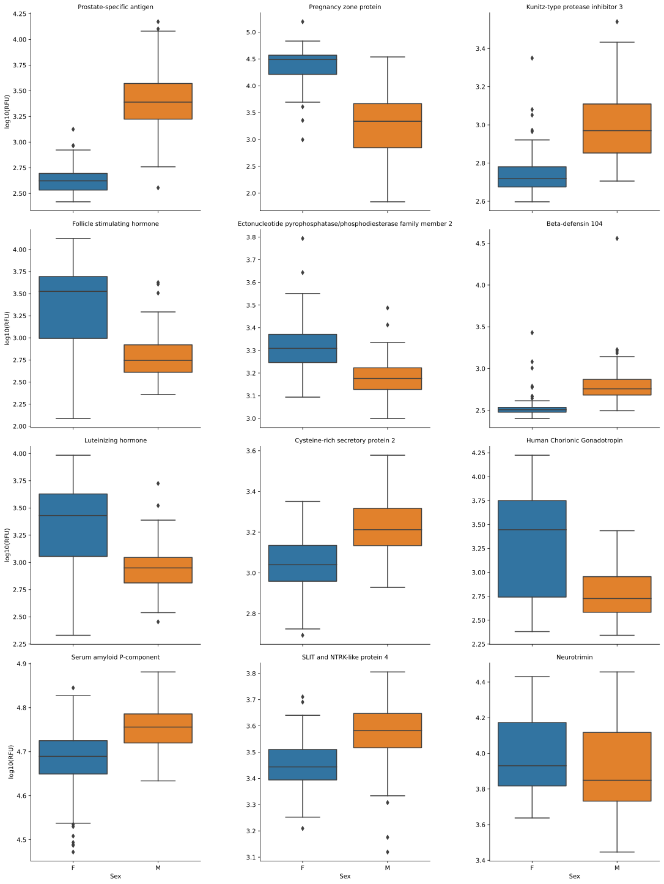
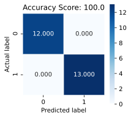
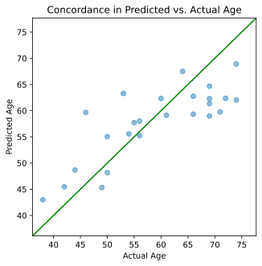

# The Python `Canopy` Package from Somalogic, Inc.


[](https://choosealicense.com/licenses/mit/)

-----

## Overview

This document accompanies the Python package `canopy`, which loads the SomaLogic, Inc. proprietary data file called an `*.adat`. The package provides auxiliary functions for extracting relevant information from the ADAT object once in the Python environment. Basic familiarity with the Python environment is assumed, as is the ability to install contributed packages from the Python Package Installer (pip)

-----

## Installation
The easiest way to install `Canopy` is to install directly from
GitHub:

``` bash
pip install git+https://github.com/SomaLogic/canopy.git#egg=canopy
```

Alternatively, if you wish to develop or change the source code, you may clone the repository and install manually via:

``` bash
git clone https://github.com/SomaLogic/canopy.git
pip install -e ./canopy
```

### Dependencies

`Python >3.8` is required to install `canopy`. The following package dependencies are installed on a `pip install`:
  - `pandas >= 1.1.0`
  - `numpy >= 1.19.1`


## Basics

Upon installation, load `canopy` as normal:


```python
import canopy
```

### For a traversable index of the library:


```python
help(canopy)
# help(canopy.adat) ... etc
```

*Output*
``` python
#> Help on package canopy:
#> 
#> NAME
#>     canopy
#> 
#> PACKAGE CONTENTS
#>     adat
#>     base (package)
#>     data (package)
#>     errors
#>     io (package)
#>     tools (package)
#> 
#> FILE
#>     /Users/jallison/Code/canopy/canopy/__init__.py
#> 
#> 
#> 
```

### Internal Objects

The `canopy` package comes with one internal object available to users to run canned examples (or analyses). It can be accessed by perform the import:

  - `from canopy.data.example_data import example_data`

## Main Features (I/O)

  - Loading data (Import)
      - Import a text file in the `*.adat` format into a `Python` session as an `adat` object.
  - Wrangling data (Manipulation)
      - Subset, reorder, and list various fields of an `adat` object.
  - Exporting data (Output)
      - Write out an `adat` object as a `*.adat` text file.

-----

### Loading an ADAT

Loading the sample file from within the canopy library via its path


```python
adat = canopy.read_file('./canopy/data/example_data.adat')
type(adat)
```


*Output*
``` python
#> canopy.adat.Adat
```


You may also access the dict header metadata via:


```python
header_meta = adat.header_metadata
```

Canopy's Adat object inherits the pandas printing methods which displays nicely in Jupyter Notebooks when using `IPython.display.display()`.

### Wrangling
Dataframe `columns` Contain Feature Information


```python
# Using the `adat` loaded from above
aptamer_df = adat.columns.to_frame(index=False)
type(aptamer_df)
```


*Output*
``` python
#> pandas.core.frame.DataFrame
```


### Accessing feature data

The `.to_frame()` method creates a lookup table that links the feature names in the `adat` object to the annotation data in `columns`:


```python
col_df = adat.columns.to_frame(index=False)
type(col_df)
```


*Output*
``` python
#> pandas.core.frame.DataFrame
```


### Display features


```python
adat.columns.get_level_values('SeqId')[:20] # first 20 features
```


*Output*
``` python
#> Index(['10000-28', '10001-7', '10003-15', '10006-25', '10008-43', '10011-65',
#>        '10012-5', '10013-34', '10014-31', '10015-119', '10021-1', '10022-207',
#>        '10023-32', '10024-44', '10030-8', '10034-16', '10035-6', '10036-201',
#>        '10037-98', '10040-63'],
#>       dtype='object', name='SeqId')
```


### Get # Features


```python
adat.shape[1]
```


*Output*
``` python
#> 5284
```


### Clinical Data

Dataframe `index` Contains Sample Information


```python
# Using the `adat` loaded from above
sample_df = adat.index.to_frame(index=False)
type(sample_df)
```


*Output*
``` python
#> pandas.core.frame.DataFrame
```


### Math
You may perform mathematical transformations on the feature data via apply or calling those functions and passing the entire dataframe.


```python
import numpy as np
# Using the `adat` loaded from above
log10_adat = adat.apply(np.log10)  # equivalent to `np.log10(adat)`
rounded_adat = adat.apply(round, args=[5,])  # equivalent to `round(adat, 5)`
sqrt_adat = adat.apply(np.sqrt)  # equivlane to `np.sqrt(adat)`
```

### Subsetting/Slicing the Dataframe

You may extract certain subgroups of samples and/or features. Canopy augments the pandas dataframe with a number of helper functions to aid the user.


```python
# Extract rows of only calibrator-type samples
calibrator_adat = adat.pick_on_meta(axis=0, name='SampleType', values=['Calibrator'])

# Exclude calibrator-type samples
non_calibrator_adat = adat.exclude_on_meta(axis=0, name='SampleType', values=['Calibrator'])

# Extract columns containing features that start with 'MMP'
target_names = adat.columns.get_level_values('Target')
mmp_names = [target for target in target_names if target.startswith('MMP')]
mmp_adat = adat.pick_on_meta(axis=1, name='Type', values=mmp_names)
```

### Writing an `adat`


```python
adat.to_file('/tmp/out_file.adat')
```

# Typical Analyses

## Compare Groups (M/F) via t-test


```python
from canopy.data.example_data import example_data # Example ADAT included with Canopy
from scipy.stats import ttest_ind
from collections import Counter
import matplotlib.pyplot as plt
import seaborn as sns
import pandas as pd
import numpy as np
from io import StringIO
```

### Display the shape of the adat (rows, columns)


```python
example_data.shape
```


*Output*
``` python
#> (192, 5284)
```


### Describe the sample types within the adat and display their counts


```python
Counter(example_data.index.get_level_values('SampleType'))
```


*Output*
``` python
#> Counter({'Sample': 170, 'Calibrator': 10, 'Buffer': 6, 'QC': 6})
```


### Prepare the adat for analysis


```python
filtered_transformed_data = (
    example_data
        .exclude_on_meta(axis=0, name='Sex', values=[''])            # rm NAs if present
        .pick_on_meta(axis=0, name='SampleType', values=['Sample'])  # rm control samples
        .apply(np.log10)                                             # log10-transform
)

clean_data = (
    filtered_transformed_data
        .insert_keyed_meta(                                          # map Sex -> 0/1
            axis=0,
            key_meta_name='Sex',
            inserted_meta_name='Group',
            values_dict={'M': 1, 'F': 0}
        )
        .apply(lambda x: x - x.mean(), axis=0)                       # center features
        .apply(lambda x: x / x.std(), axis=0)                        # scale features
)
```

### Display the grouping counts


```python
print(clean_data.index.to_frame()['Sex'].value_counts())
print(clean_data.index.to_frame()['Group'].value_counts())
```

*Output*
``` python
#> F    85
#> M    84
#> Name: Sex, dtype: int64
#> 0    85
#> 1    84
#> Name: Group, dtype: int64
#> 
```

### Split the adat based on `Group` and perform t-test across all aptamers


```python
tt_g0 = clean_data.pick_on_meta(axis=0, name='Group', values=[0])
tt_g1 = clean_data.pick_on_meta(axis=0, name='Group', values=[1])

tt_res = ttest_ind(tt_g0, tt_g1)
t_tests = list(zip(clean_data.columns.get_level_values('TargetFullName'), tt_res.pvalue))
```

### Sort the results and display the 12 aptamers with the most significant p-values


```python
t_tests_sorted = sorted(t_tests, key=lambda x: x[1])
tt_top_12_analytes = [name for name, p_value in t_tests_sorted[:12]]
tt_top_12_analytes
```


*Output*
``` python
#> ['Prostate-specific antigen',
#>  'Pregnancy zone protein',
#>  'Kunitz-type protease inhibitor 3',
#>  'Follicle stimulating hormone',
#>  'Ectonucleotide pyrophosphatase/phosphodiesterase family member 2',
#>  'Beta-defensin 104',
#>  'Luteinizing hormone',
#>  'Cysteine-rich secretory protein 2',
#>  'Human Chorionic Gonadotropin',
#>  'Serum amyloid P-component',
#>  'SLIT and NTRK-like protein 4',
#>  'Neurotrimin']
```


### Plot the `Group` log(RFU) for each aptamer


```python
tt_df= (
    filtered_transformed_data
        .pick_meta(axis=1, names=['TargetFullName'])
        .pick_on_meta(axis=1, name='TargetFullName', values=tt_top_12_analytes)[tt_top_12_analytes]
        .reset_index()
)

tt_melted_df = pd.melt(tt_df, value_vars=tt_top_12_analytes, id_vars='Sex', value_name='log10(RFU)')

tt_p = sns.catplot(
    x='Sex',
    y='log10(RFU)',
    col='TargetFullName',
    data=tt_melted_df,
    kind='box',
    col_wrap=3,
    sharey=False
)
tt_p.set_titles(row_template='{row_name}', col_template='{col_name}')
plt.show()
```





## Logistic Regression (Predict Sex)


```python
# Import the libraries that we need for this analysis
from sklearn.model_selection import train_test_split
from sklearn import metrics
from scipy.stats import pearsonr
import statsmodels.api as sm
from IPython.display import HTML
```

### Prepare the data for LogisticRegression


```python
# Wrangle `clean_data` into a simpler form
logr_x_df = (
    clean_data
        .pick_meta(axis=1, names=['SeqId', 'TargetFullName'])
        .reset_index(drop=True)
)
logr_y_df = (
    clean_data.index.get_level_values('Group')
)

# Split the dataset into train and test, holding back 25 samples for testing
logr_x_train, logr_x_test, logr_y_train, logr_y_test = train_test_split(logr_x_df, logr_y_df, test_size=25, random_state=0)
```

### Perform univariate logistic regression for each aptamer


```python
logr_apt_perf = []
for seq_info in logr_x_train:
    x = sm.add_constant(logr_x_train[seq_info]) # Need to add the intercept term since sm.GLM does not automatically do it
    mod = sm.GLM(logr_y_train, x, family=sm.families.Binomial())
    res = mod.fit()
    logr_apt_perf.append(res.summary2().tables[1].loc[[seq_info]])
```

### Wrangle the GLM results of each aptamer into a dataframe and sort them by p-value


```python
logr_df = pd.concat(logr_apt_perf).reset_index()
logr_df['SeqId'] = [x[0] for x in logr_df['index']]
logr_df['TargetFullName'] = [x[1] for x in logr_df['index']]
logr_df = logr_df.drop('index', axis=1)
logr_df = logr_df[['SeqId', 'TargetFullName', 'Coef.', 'Std.Err.', 'z', 'P>|z|', '[0.025', '0.975]']].set_index('SeqId')
logr_df_sorted = logr_df.sort_values('P>|z|')
HTML(logr_df_sorted.head(20).to_html())
```


*Output*
<div>
<table border="1" class="dataframe">
  <thead>
    <tr style="text-align: right;">
      <th></th>
      <th>TargetFullName</th>
      <th>Coef.</th>
      <th>Std.Err.</th>
      <th>z</th>
      <th>P&gt;|z|</th>
      <th>[0.025</th>
      <th>0.975]</th>
    </tr>
    <tr>
      <th>SeqId</th>
      <th></th>
      <th></th>
      <th></th>
      <th></th>
      <th></th>
      <th></th>
      <th></th>
    </tr>
  </thead>
  <tbody>
    <tr>
      <th>6580-29</th>
      <td>Pregnancy zone protein</td>
      <td>-3.358125</td>
      <td>0.537520</td>
      <td>-6.247448</td>
      <td>4.172128e-10</td>
      <td>-4.411644</td>
      <td>-2.304606</td>
    </tr>
    <tr>
      <th>5763-67</th>
      <td>Beta-defensin 104</td>
      <td>2.863822</td>
      <td>0.462327</td>
      <td>6.194362</td>
      <td>5.852166e-10</td>
      <td>1.957677</td>
      <td>3.769966</td>
    </tr>
    <tr>
      <th>3032-11</th>
      <td>Follicle stimulating hormone</td>
      <td>-1.626249</td>
      <td>0.264846</td>
      <td>-6.140347</td>
      <td>8.234151e-10</td>
      <td>-2.145338</td>
      <td>-1.107159</td>
    </tr>
    <tr>
      <th>7926-13</th>
      <td>Kunitz-type protease inhibitor 3</td>
      <td>2.533244</td>
      <td>0.427489</td>
      <td>5.925868</td>
      <td>3.106519e-09</td>
      <td>1.695381</td>
      <td>3.371107</td>
    </tr>
    <tr>
      <th>9282-12</th>
      <td>Cysteine-rich secretory protein 2</td>
      <td>1.995345</td>
      <td>0.345258</td>
      <td>5.779283</td>
      <td>7.501965e-09</td>
      <td>1.318651</td>
      <td>2.672038</td>
    </tr>
    <tr>
      <th>16892-23</th>
      <td>Ectonucleotide pyrophosphatase/phosphodiesterase family member 2</td>
      <td>-2.042265</td>
      <td>0.356588</td>
      <td>-5.727234</td>
      <td>1.020812e-08</td>
      <td>-2.741165</td>
      <td>-1.343365</td>
    </tr>
    <tr>
      <th>4914-10</th>
      <td>Human Chorionic Gonadotropin</td>
      <td>-1.374284</td>
      <td>0.240818</td>
      <td>-5.706726</td>
      <td>1.151699e-08</td>
      <td>-1.846279</td>
      <td>-0.902289</td>
    </tr>
    <tr>
      <th>2953-31</th>
      <td>Luteinizing hormone</td>
      <td>-1.396186</td>
      <td>0.250702</td>
      <td>-5.569096</td>
      <td>2.560645e-08</td>
      <td>-1.887553</td>
      <td>-0.904818</td>
    </tr>
    <tr>
      <th>2474-54</th>
      <td>Serum amyloid P-component</td>
      <td>1.736295</td>
      <td>0.324984</td>
      <td>5.342701</td>
      <td>9.157157e-08</td>
      <td>1.099337</td>
      <td>2.373253</td>
    </tr>
    <tr>
      <th>8428-102</th>
      <td>Neurotrimin</td>
      <td>-1.252695</td>
      <td>0.239697</td>
      <td>-5.226152</td>
      <td>1.730742e-07</td>
      <td>-1.722493</td>
      <td>-0.782896</td>
    </tr>
    <tr>
      <th>2696-87</th>
      <td>Persephin</td>
      <td>2.020417</td>
      <td>0.387468</td>
      <td>5.214408</td>
      <td>1.844053e-07</td>
      <td>1.260994</td>
      <td>2.779841</td>
    </tr>
    <tr>
      <th>5116-62</th>
      <td>Roundabout homolog 2</td>
      <td>-1.273841</td>
      <td>0.268220</td>
      <td>-4.749239</td>
      <td>2.041831e-06</td>
      <td>-1.799543</td>
      <td>-0.748140</td>
    </tr>
    <tr>
      <th>3066-12</th>
      <td>Galectin-3</td>
      <td>-0.988967</td>
      <td>0.209618</td>
      <td>-4.717944</td>
      <td>2.382404e-06</td>
      <td>-1.399811</td>
      <td>-0.578123</td>
    </tr>
    <tr>
      <th>9002-36</th>
      <td>Serpin A11</td>
      <td>-1.038507</td>
      <td>0.220170</td>
      <td>-4.716841</td>
      <td>2.395351e-06</td>
      <td>-1.470032</td>
      <td>-0.606982</td>
    </tr>
    <tr>
      <th>5451-1</th>
      <td>CD166 antigen</td>
      <td>-1.003051</td>
      <td>0.220619</td>
      <td>-4.546530</td>
      <td>5.453754e-06</td>
      <td>-1.435456</td>
      <td>-0.570646</td>
    </tr>
    <tr>
      <th>7139-14</th>
      <td>SLIT and NTRK-like protein 4</td>
      <td>0.983042</td>
      <td>0.217822</td>
      <td>4.513051</td>
      <td>6.390155e-06</td>
      <td>0.556119</td>
      <td>1.409965</td>
    </tr>
    <tr>
      <th>5934-1</th>
      <td>Ferritin</td>
      <td>0.994552</td>
      <td>0.224264</td>
      <td>4.434731</td>
      <td>9.218748e-06</td>
      <td>0.555002</td>
      <td>1.434102</td>
    </tr>
    <tr>
      <th>15324-58</th>
      <td>Ferritin light chain</td>
      <td>0.994265</td>
      <td>0.224272</td>
      <td>4.433295</td>
      <td>9.280383e-06</td>
      <td>0.554700</td>
      <td>1.433831</td>
    </tr>
    <tr>
      <th>8484-24</th>
      <td>Leptin</td>
      <td>-0.945567</td>
      <td>0.214262</td>
      <td>-4.413131</td>
      <td>1.018865e-05</td>
      <td>-1.365513</td>
      <td>-0.525621</td>
    </tr>
    <tr>
      <th>8468-19</th>
      <td>Prostate-specific antigen</td>
      <td>7.350184</td>
      <td>1.671012</td>
      <td>4.398641</td>
      <td>1.089308e-05</td>
      <td>4.075060</td>
      <td>10.625308</td>
    </tr>
  </tbody>
</table>
</div>


### Fit model


```python
logr_top_analytes = [(index, row['TargetFullName']) for index, row in logr_df_sorted.head(5).iterrows()] # Select the top 5 aptamers based on p-value
x = sm.add_constant(logr_x_train[logr_top_analytes])
logr_mod = sm.GLM(logr_y_train, x, family=sm.families.Binomial())
logr_res = logr_mod.fit()
logr_res.summary()
```


*Output*
<div>
<table class="simpletable">
<caption>Generalized Linear Model Regression Results</caption>
<tr>
  <th>Dep. Variable:</th>           <td>y</td>        <th>  No. Observations:  </th>  <td>   144</td> 
</tr>
<tr>
  <th>Model:</th>                  <td>GLM</td>       <th>  Df Residuals:      </th>  <td>   138</td> 
</tr>
<tr>
  <th>Model Family:</th>        <td>Binomial</td>     <th>  Df Model:          </th>  <td>     5</td> 
</tr>
<tr>
  <th>Link Function:</th>         <td>logit</td>      <th>  Scale:             </th> <td>  1.0000</td>
</tr>
<tr>
  <th>Method:</th>                <td>IRLS</td>       <th>  Log-Likelihood:    </th> <td> -10.883</td>
</tr>
<tr>
  <th>Date:</th>            <td>Mon, 14 Sep 2020</td> <th>  Deviance:          </th> <td>  21.767</td>
</tr>
<tr>
  <th>Time:</th>                <td>16:49:54</td>     <th>  Pearson chi2:      </th>  <td>  23.7</td> 
</tr>
<tr>
  <th>No. Iterations:</th>          <td>9</td>        <th>                     </th>     <td> </td>   
</tr>
<tr>
  <th>Covariance Type:</th>     <td>nonrobust</td>    <th>                     </th>     <td> </td>   
</tr>
</table>
<table class="simpletable">
<tr>
                          <td></td>                            <th>coef</th>     <th>std err</th>      <th>z</th>      <th>P>|z|</th>  <th>[0.025</th>    <th>0.975]</th>  
</tr>
<tr>
  <th>const</th>                                            <td>    1.2803</td> <td>    0.825</td> <td>    1.552</td> <td> 0.121</td> <td>   -0.336</td> <td>    2.897</td>
</tr>
<tr>
  <th>('6580-29', 'Pregnancy zone protein')</th>            <td>   -4.9599</td> <td>    1.696</td> <td>   -2.925</td> <td> 0.003</td> <td>   -8.284</td> <td>   -1.636</td>
</tr>
<tr>
  <th>('5763-67', 'Beta-defensin 104')</th>                 <td>    1.6672</td> <td>    0.681</td> <td>    2.447</td> <td> 0.014</td> <td>    0.332</td> <td>    3.003</td>
</tr>
<tr>
  <th>('3032-11', 'Follicle stimulating hormone')</th>      <td>   -2.2390</td> <td>    1.132</td> <td>   -1.977</td> <td> 0.048</td> <td>   -4.458</td> <td>   -0.020</td>
</tr>
<tr>
  <th>('7926-13', 'Kunitz-type protease inhibitor 3')</th>  <td>    1.6874</td> <td>    0.921</td> <td>    1.832</td> <td> 0.067</td> <td>   -0.118</td> <td>    3.493</td>
</tr>
<tr>
  <th>('9282-12', 'Cysteine-rich secretory protein 2')</th> <td>    1.5980</td> <td>    0.804</td> <td>    1.987</td> <td> 0.047</td> <td>    0.022</td> <td>    3.174</td>
</tr>
</table>
</div>


```python
# Create confusion matrix
x = sm.add_constant(logr_x_test[logr_top_analytes])
logr_predictions = [1 if val > 0.5 else 0 for val in logr_res.predict(x)]
cm = metrics.confusion_matrix(logr_y_test.values, logr_predictions)
```


```python
# Print out performance metrics via Pandas
tp = cm[1, 1]
tn = cm[0, 0]
fp = cm[0, 1]
fn = cm[1, 0]
logr_perf_df = pd.DataFrame.from_records({
    'Sensitivity': tp / (tp + fn),
    'Specificity': tn / (tn + fp),
    'Accuracy': (tp + tn) / sum(sum(cm)),
    'PPV': tp / (tp + fp),
    'NPV': tn / (tn + fn)
}, index=['Value'])
logr_perf_df
```


*Output*
``` python
#> '<table border="1" class="dataframe">\n  <thead>\n    <tr style="text-align: right;">\n      <th></th>\n      <th>Accuracy</th>\n      <th>NPV</th>\n      <th>PPV</th>\n      <th>Sensitivity</th>\n      <th>Specificity</th>\n    </tr>\n  </thead>\n  <tbody>\n    <tr>\n      <th>Value</th>\n      <td>1.0</td>\n      <td>1.0</td>\n      <td>1.0</td>\n      <td>1.0</td>\n      <td>1.0</td>\n    </tr>\n  </tbody>\n</table>'
```


```python
# Display the confusion matrix
plt.figure(figsize=(3,3))
sns.heatmap(cm, annot=True, fmt=".3f", linewidths=.5, square=True, cmap='Blues')
plt.ylabel('Actual label')
plt.xlabel('Predicted label')
all_sample_title = 'Accuracy Score: {0}'.format(100 * logr_perf_df['Accuracy'].values[0])
plt.title(all_sample_title)
plt.show()
```





## Linear Regression (Predict Age)
We use the same `clean_data` as the logistic regression analysis above.

### Wrangle data


```python
# Wrangle `clean_data` into a simpler form
linr_x_df = (
    clean_data
        .pick_meta(axis=1, names=['SeqId', 'TargetFullName'])
        .reset_index(drop=True)
)
linr_y = (
    [float(age) for age in clean_data.index.get_level_values('Age')]
)

# Split the dataset into train and test, holding back 25 samples for testing
linr_x_train, linr_x_test, linr_y_train, linr_y_test = train_test_split(linr_x_df, linr_y, test_size=25, random_state=5)
```

### Perform univariate linear regression for each aptamer


```python
linr_apt_perf = []
for seq_info in linr_x_df:
    x = sm.add_constant(linr_x_train[seq_info])
    mod = sm.OLS(linr_y_train, x)
    res = mod.fit()
    linr_apt_perf.append(res.summary2().tables[1].loc[[seq_info]])
```

### Wrangle the GLM results of each aptamer into a dataframe and sort them by p-value


```python
linr_res_df = pd.concat(linr_apt_perf).reset_index()
linr_res_df['SeqId'] = [x[0] for x in linr_res_df['index']]
linr_res_df['TargetFullName'] = [x[1] for x in linr_res_df['index']]
linr_res_df = linr_res_df.drop('index', axis=1)
linr_res_df = linr_res_df[['SeqId', 'TargetFullName', 'Coef.', 'Std.Err.', 't', 'P>|t|', '[0.025', '0.975]']].set_index('SeqId')
linr_sorted_res_df = linr_res_df.sort_values('P>|t|')
linr_sorted_res_df.head(20)
```


*Output*
<div>
<div>
<style scoped>
    .dataframe tbody tr th:only-of-type {
        vertical-align: middle;
    }

    .dataframe tbody tr th {
        vertical-align: top;
    }

    .dataframe thead th {
        text-align: right;
    }
</style>
<table border="1" class="dataframe">
  <thead>
    <tr style="text-align: right;">
      <th></th>
      <th>TargetFullName</th>
      <th>Coef.</th>
      <th>Std.Err.</th>
      <th>t</th>
      <th>P&gt;|t|</th>
      <th>[0.025</th>
      <th>0.975]</th>
    </tr>
    <tr>
      <th>SeqId</th>
      <th></th>
      <th></th>
      <th></th>
      <th></th>
      <th></th>
      <th></th>
      <th></th>
    </tr>
  </thead>
  <tbody>
    <tr>
      <th>3045-72</th>
      <td>Pleiotrophin</td>
      <td>6.732423</td>
      <td>0.871214</td>
      <td>7.727634</td>
      <td>1.812643e-12</td>
      <td>5.010198</td>
      <td>8.454649</td>
    </tr>
    <tr>
      <th>4374-45</th>
      <td>Growth/differentiation factor 15</td>
      <td>6.785323</td>
      <td>0.908699</td>
      <td>7.467076</td>
      <td>7.579666e-12</td>
      <td>4.988997</td>
      <td>8.581649</td>
    </tr>
    <tr>
      <th>3024-18</th>
      <td>Alpha-2-antiplasmin</td>
      <td>-6.301072</td>
      <td>0.900901</td>
      <td>-6.994193</td>
      <td>9.651308e-11</td>
      <td>-8.081983</td>
      <td>-4.520162</td>
    </tr>
    <tr>
      <th>6392-7</th>
      <td>WNT1-inducible-signaling pathway protein 2</td>
      <td>6.229139</td>
      <td>0.900966</td>
      <td>6.913842</td>
      <td>1.476254e-10</td>
      <td>4.448099</td>
      <td>8.010179</td>
    </tr>
    <tr>
      <th>8480-29</th>
      <td>EGF-containing fibulin-like extracellular matr...</td>
      <td>6.195214</td>
      <td>0.906161</td>
      <td>6.836766</td>
      <td>2.214593e-10</td>
      <td>4.403904</td>
      <td>7.986524</td>
    </tr>
    <tr>
      <th>15640-54</th>
      <td>Transgelin</td>
      <td>6.178240</td>
      <td>0.910801</td>
      <td>6.783303</td>
      <td>2.930374e-10</td>
      <td>4.377758</td>
      <td>7.978721</td>
    </tr>
    <tr>
      <th>15533-97</th>
      <td>Macrophage scavenger receptor types I and II</td>
      <td>6.017326</td>
      <td>0.913196</td>
      <td>6.589306</td>
      <td>8.024776e-10</td>
      <td>4.212111</td>
      <td>7.822541</td>
    </tr>
    <tr>
      <th>16818-200</th>
      <td>CUB domain-containing protein 1</td>
      <td>5.954078</td>
      <td>0.908302</td>
      <td>6.555172</td>
      <td>9.566985e-10</td>
      <td>4.158536</td>
      <td>7.749620</td>
    </tr>
    <tr>
      <th>15386-7</th>
      <td>Fatty acid-binding protein, adipocyte</td>
      <td>6.147742</td>
      <td>0.937962</td>
      <td>6.554363</td>
      <td>9.606852e-10</td>
      <td>4.293569</td>
      <td>8.001916</td>
    </tr>
    <tr>
      <th>4496-60</th>
      <td>Macrophage metalloelastase</td>
      <td>6.166874</td>
      <td>0.946260</td>
      <td>6.517104</td>
      <td>1.163272e-09</td>
      <td>4.296297</td>
      <td>8.037450</td>
    </tr>
    <tr>
      <th>3362-61</th>
      <td>Chordin-like protein 1</td>
      <td>5.780924</td>
      <td>0.919581</td>
      <td>6.286478</td>
      <td>3.755897e-09</td>
      <td>3.963086</td>
      <td>7.598761</td>
    </tr>
    <tr>
      <th>4541-49</th>
      <td>Cell adhesion molecule-related/down-regulated ...</td>
      <td>-5.718647</td>
      <td>0.912113</td>
      <td>-6.269669</td>
      <td>4.087372e-09</td>
      <td>-7.521723</td>
      <td>-3.915572</td>
    </tr>
    <tr>
      <th>3600-2</th>
      <td>Chitotriosidase-1</td>
      <td>5.856444</td>
      <td>0.957006</td>
      <td>6.119547</td>
      <td>8.653479e-09</td>
      <td>3.964624</td>
      <td>7.748265</td>
    </tr>
    <tr>
      <th>2609-59</th>
      <td>Cystatin-C</td>
      <td>5.597775</td>
      <td>0.939942</td>
      <td>5.955449</td>
      <td>1.942636e-08</td>
      <td>3.739688</td>
      <td>7.455863</td>
    </tr>
    <tr>
      <th>14133-93</th>
      <td>Interleukin-1 receptor type 2</td>
      <td>-5.528151</td>
      <td>0.931736</td>
      <td>-5.933175</td>
      <td>2.166003e-08</td>
      <td>-7.370017</td>
      <td>-3.686286</td>
    </tr>
    <tr>
      <th>3234-23</th>
      <td>Coiled-coil domain-containing protein 80</td>
      <td>5.662008</td>
      <td>0.954940</td>
      <td>5.929177</td>
      <td>2.208681e-08</td>
      <td>3.774272</td>
      <td>7.549744</td>
    </tr>
    <tr>
      <th>2677-1</th>
      <td>Epidermal growth factor receptor</td>
      <td>-5.382225</td>
      <td>0.924818</td>
      <td>-5.819765</td>
      <td>3.756576e-08</td>
      <td>-7.210415</td>
      <td>-3.554034</td>
    </tr>
    <tr>
      <th>9793-145</th>
      <td>Immunoglobulin superfamily DCC subclass member 4</td>
      <td>-5.320160</td>
      <td>0.916639</td>
      <td>-5.803985</td>
      <td>4.053771e-08</td>
      <td>-7.132183</td>
      <td>-3.508138</td>
    </tr>
    <tr>
      <th>19601-15</th>
      <td>Ankyrin repeat and SOCS box protein 9</td>
      <td>5.425709</td>
      <td>0.936318</td>
      <td>5.794729</td>
      <td>4.238697e-08</td>
      <td>3.574786</td>
      <td>7.276633</td>
    </tr>
    <tr>
      <th>4968-50</th>
      <td>Macrophage-capping protein</td>
      <td>5.359391</td>
      <td>0.932439</td>
      <td>5.747713</td>
      <td>5.313343e-08</td>
      <td>3.516135</td>
      <td>7.202646</td>
    </tr>
  </tbody>
</table>
</div>
</div>


### Feed top 8 SOMAmers into statsmodels OLS regression


```python
linr_top_analytes = [(index, row['TargetFullName']) for index, row in linr_sorted_res_df.head(8).iterrows()]
x = sm.add_constant(linr_x_train[linr_top_analytes])
mod = sm.OLS(linr_y_train, x).fit()
mod.summary()
```


*Output*
<div>
<table class="simpletable">
<caption>OLS Regression Results</caption>
<tr>
  <th>Dep. Variable:</th>            <td>y</td>        <th>  R-squared:         </th> <td>   0.522</td>
</tr>
<tr>
  <th>Model:</th>                   <td>OLS</td>       <th>  Adj. R-squared:    </th> <td>   0.494</td>
</tr>
<tr>
  <th>Method:</th>             <td>Least Squares</td>  <th>  F-statistic:       </th> <td>   18.43</td>
</tr>
<tr>
  <th>Date:</th>             <td>Mon, 14 Sep 2020</td> <th>  Prob (F-statistic):</th> <td>1.88e-18</td>
</tr>
<tr>
  <th>Time:</th>                 <td>16:50:36</td>     <th>  Log-Likelihood:    </th> <td> -516.03</td>
</tr>
<tr>
  <th>No. Observations:</th>      <td>   144</td>      <th>  AIC:               </th> <td>   1050.</td>
</tr>
<tr>
  <th>Df Residuals:</th>          <td>   135</td>      <th>  BIC:               </th> <td>   1077.</td>
</tr>
<tr>
  <th>Df Model:</th>              <td>     8</td>      <th>                     </th>     <td> </td>   
</tr>
<tr>
  <th>Covariance Type:</th>      <td>nonrobust</td>    <th>                     </th>     <td> </td>   
</tr>
</table>
<table class="simpletable">
<tr>
                                      <td></td>                                         <th>coef</th>     <th>std err</th>      <th>t</th>      <th>P>|t|</th>  <th>[0.025</th>    <th>0.975]</th>  
</tr>
<tr>
  <th>const</th>                                                                     <td>   55.4940</td> <td>    0.753</td> <td>   73.723</td> <td> 0.000</td> <td>   54.005</td> <td>   56.983</td>
</tr>
<tr>
  <th>('3045-72', 'Pleiotrophin')</th>                                               <td>    1.8217</td> <td>    1.156</td> <td>    1.576</td> <td> 0.117</td> <td>   -0.464</td> <td>    4.108</td>
</tr>
<tr>
  <th>('4374-45', 'Growth/differentiation factor 15')</th>                           <td>    0.3976</td> <td>    1.261</td> <td>    0.315</td> <td> 0.753</td> <td>   -2.096</td> <td>    2.892</td>
</tr>
<tr>
  <th>('3024-18', 'Alpha-2-antiplasmin')</th>                                        <td>   -2.5607</td> <td>    0.897</td> <td>   -2.855</td> <td> 0.005</td> <td>   -4.335</td> <td>   -0.787</td>
</tr>
<tr>
  <th>('6392-7', 'WNT1-inducible-signaling pathway protein 2')</th>                  <td>    2.1706</td> <td>    0.924</td> <td>    2.349</td> <td> 0.020</td> <td>    0.343</td> <td>    3.998</td>
</tr>
<tr>
  <th>('8480-29', 'EGF-containing fibulin-like extracellular matrix protein 1')</th> <td>    1.8377</td> <td>    0.950</td> <td>    1.934</td> <td> 0.055</td> <td>   -0.042</td> <td>    3.717</td>
</tr>
<tr>
  <th>('15640-54', 'Transgelin')</th>                                                <td>    1.4354</td> <td>    0.995</td> <td>    1.443</td> <td> 0.151</td> <td>   -0.533</td> <td>    3.403</td>
</tr>
<tr>
  <th>('15533-97', 'Macrophage scavenger receptor types I and II')</th>              <td>   -0.3616</td> <td>    1.251</td> <td>   -0.289</td> <td> 0.773</td> <td>   -2.835</td> <td>    2.112</td>
</tr>
<tr>
  <th>('16818-200', 'CUB domain-containing protein 1')</th>                          <td>    3.0067</td> <td>    1.135</td> <td>    2.649</td> <td> 0.009</td> <td>    0.762</td> <td>    5.251</td>
</tr>
</table>
<table class="simpletable">
<tr>
  <th>Omnibus:</th>       <td> 3.316</td> <th>  Durbin-Watson:     </th> <td>   2.039</td>
</tr>
<tr>
  <th>Prob(Omnibus):</th> <td> 0.191</td> <th>  Jarque-Bera (JB):  </th> <td>   2.838</td>
</tr>
<tr>
  <th>Skew:</th>          <td>-0.324</td> <th>  Prob(JB):          </th> <td>   0.242</td>
</tr>
<tr>
  <th>Kurtosis:</th>      <td> 3.228</td> <th>  Cond. No.          </th> <td>    4.16</td>
</tr>
</table><br/><br/>Warnings:<br/>[1] Standard Errors assume that the covariance matrix of the errors is correctly specified.
</div>


### Compute predictions on test set


```python
x = sm.add_constant(linr_x_test[linr_top_analytes])
linr_predictions = mod.predict(x)
linr_pred_df = pd.DataFrame({
    'Actual Age': linr_y_test,
    'Predicted Age': linr_predictions
})

linr_pred_df['Pred Error'] = linr_pred_df['Predicted Age'] - linr_pred_df['Actual Age']
```

### Compute model performance


```python
# Lin's Concordance Correl. Coef.
# Accounts for location + scale shifts
def linCCC(x, y):
    if len(x) != len(y):
        raise Exception('Arrays are not the same length!')
    a = 2 * pearsonr(x, y)[0] * np.std(x, ddof=1) * np.std(y, ddof=1)
    b = np.var(x, ddof=1) + np.var(y, ddof=1) + (np.mean(x) - np.mean(y))**2
    return a / b

n = linr_x_test.shape[0]
p = len(linr_top_analytes)

# Regression metrics
linr_metrics_df = pd.DataFrame({
    'rss': linr_pred_df['Pred Error'].apply(lambda x: x**2).sum(), # residual sum of squares
    'tss': sum((linr_pred_df['Actual Age'] - linr_pred_df['Actual Age'].mean()) ** 2), # total sum of squares
    'R2': pearsonr(linr_pred_df['Actual Age'], linr_pred_df['Predicted Age'])[0] ** 2, # R-squared Pearson approx.
    'MAE': np.mean(np.abs(linr_pred_df['Pred Error'])), # Mean absolute error
    'RMSE': np.sqrt(np.mean(linr_pred_df['Pred Error'] ** 2)), # Root mean squared error
    'CCC': linCCC(linr_predictions, linr_y_test) # Lins concordance correlation coefficient
}, index=['Value'])

linr_metrics_df['rsq'] = 1 - (linr_metrics_df['rss'] / linr_metrics_df['tss']) # R-squared
linr_metrics_df['rsqadj'] = max(0, 1 - (1 - linr_metrics_df['rsq'][0]) * (n - 1) / (n - p - 1)), # Adjusted R-squared

linr_metrics_df
```


*Output*
<div>
<div>
<style scoped>
    .dataframe tbody tr th:only-of-type {
        vertical-align: middle;
    }

    .dataframe tbody tr th {
        vertical-align: top;
    }

    .dataframe thead th {
        text-align: right;
    }
</style>
<table border="1" class="dataframe">
  <thead>
    <tr style="text-align: right;">
      <th></th>
      <th>rss</th>
      <th>tss</th>
      <th>R2</th>
      <th>MAE</th>
      <th>RMSE</th>
      <th>CCC</th>
      <th>rsq</th>
      <th>rsqadj</th>
    </tr>
  </thead>
  <tbody>
    <tr>
      <th>Value</th>
      <td>1096.870123</td>
      <td>2771.84</td>
      <td>0.642825</td>
      <td>5.561607</td>
      <td>6.623806</td>
      <td>0.723022</td>
      <td>0.604281</td>
      <td>0.406421</td>
    </tr>
  </tbody>
</table>
</div>
</div>


### Visualize performance via concordance plot of predicted and actual values


```python
f, ax = plt.subplots(1, figsize=(5, 5), dpi=150)
plot_range = [linr_pred_df[['Actual Age', 'Predicted Age']].min().min() * 0.95, linr_pred_df[['Actual Age', 'Predicted Age']].max().max() * 1.05]
ax.plot(plot_range, plot_range, c='g')
ax.scatter(linr_pred_df['Actual Age'], linr_pred_df['Predicted Age'], alpha=0.5)
ax.set(
    xlim=plot_range,
    xlabel='Actual Age',
    ylim=plot_range,
    ylabel='Predicted Age',
    title='Concordance in Predicted vs. Actual Age'
)
plt.show()
```





### Closing Remarks

  - Many variants of above possible.
  - Goal to provide general framework to handle SomaLogic data.
  - Not definitive guide in statistical theory, etc.

-----

## MIT LICENSE

  - See [LICENSE](LICENSE)
  - The MIT
        License:
      - <https://choosealicense.com/licenses/mit/>
      - [https://tldrlegal.com/license/mit-license/](https://tldrlegal.com/license/mit-license)

-----


```python

```


```python

```
