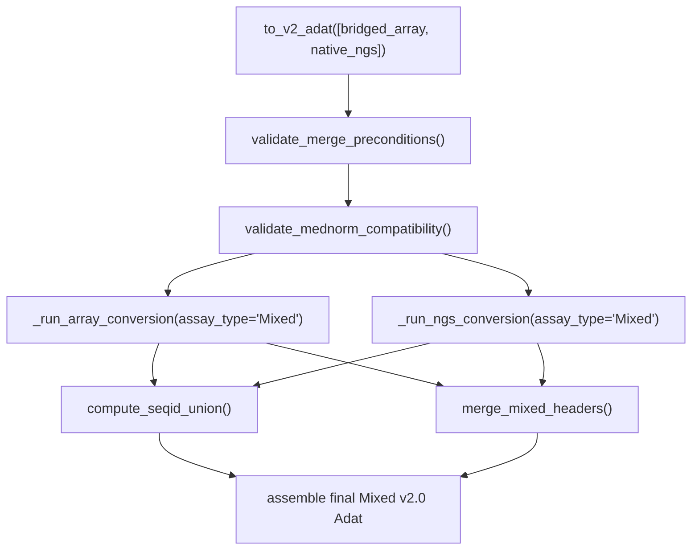

# CAN-41: Merge Logic Implementation Plan

**Ticket:** CAN-41 — ADAT v2.0 Converter — Phase 1: Merge Logic (SeqId Union, MedNorm Validation, Header Merge)  
**Created:** 2026-07-14  
**Status:** Draft  
**Depends on:** CAN-40 (NGS Field Conversions — completed)

---

## Overview

Implement the three merge subsystems for CAN-41: SeqId union with missing value fill, MedNorm reference validation, and Mixed header/metadata combination. This replaces the `_merge_bridged_array_and_ngs()` stub in converter.py with a working Path 1 end-to-end flow.

---

## Architecture

The merge flow orchestrates existing single-input converters and then combines their outputs:

Key design decision: MedNorm validation runs on the **raw** pre-conversion ADATs (checking ProcessSteps strings and `Ref.MedNormExt` vectors), while SeqId union and header merge operate on the **converted** v2.0 intermediates.

---

## New Module: `somadata/conversion/merge.py`

This is the primary new file. It contains the three public functions corresponding to the three sub-tasks plus the orchestrating merge handler. Keeping merge logic in its own module (rather than bloating `converter.py`) follows the existing pattern of `array/` and `ngs/` subpackages owning their domain.

---

## Task 1.7: SeqId Union & Missing Value Fill

**Function:** `compute_seqid_union(array_adat, ngs_adat) -> tuple[pd.DataFrame, pd.MultiIndex]`

**Algorithm:**

1. Extract SeqId sets from each converted Adat's columns (level `"SeqId"`)
2. Compute the union, sort ascending
3. Reindex both data matrices to the union SeqId set, filling missing positions with `NaN`
4. Concatenate rows (array rows on top, NGS rows below) — uses `pd.concat(axis=0)`
5. Build merged `COL_DATA` MultiIndex:
   - For shared SeqIds: combine annotation levels from both (prefer array values for shared fields, NGS fills NGS-specific fields)
   - For array-only SeqIds: NGS-specific annotation fields are blank
   - For NGS-only SeqIds: array-specific annotation fields are blank
6. Return the merged RFU DataFrame and the merged COL_DATA MultiIndex

**Key considerations:**

- Column identity is by `SeqId` level of the MultiIndex
- Platform-specific COL_DATA fields: `PlatformSpecificCalibrate_*_ScaleFactor` (array), `CrossPlatformCalibrate_*_ScaleFactor` (NGS), `DRCLevelNGS`, `BlockListNGS`, `Ref.Array.*`, `Ref.NGS.*`
- Use `pd.DataFrame.reindex(columns=union_seqids)` for efficient NaN fill

---

## Task 1.8: MedNorm Reference Validation

**Function:** `validate_mednorm_compatibility(array_adat, ngs_adat, med_norm_ref=None)`

Operates on **raw** (pre-conversion) ADATs. Raises `ProcessStepsMismatchError` or `MedNormMismatchError` on failure.

**Checks (per spec Section 3.4):**

1. **Array ProcessSteps terminal triple** — last 3 steps must be `["CrossPlatformPlateScaling", "CrossPlatformCalibrate", "MedNormExt"]`. Use `parse_process_steps()` from `_helpers.py` and check `steps[-3:]`.

2. **NGS ProcessSteps required sequence** — must be exactly: `["Raw", "HybNorm", "MedNormInt", "PlatformSpecificPlateScale", "PlatformSpecificCalibrate", "CrossPlatformPlateScale", "CrossPlatformCalibrate", "MedNormExt"]`.

3. **Ref.MedNormExt vector identity** — extract `Ref.MedNormExt.<Matrix>` columns from both ADATs' COL_DATA. For shared SeqIds, values must be element-wise identical (using exact string comparison — see design decision below).

4. **`med_norm_ref` override** — if check #3 fails but `med_norm_ref` is provided, select the reference values from whichever source's `Ref.MedNorm.Id` / `Ref.MedNormExt` matches the given identifier. Raise error if the identifier matches neither source.

**Leverages existing code:**

- `parse_process_steps()` in `somadata/conversion/_helpers.py`
- `ProcessStepsMismatchError`, `MedNormMismatchError` in `somadata/conversion/errors.py`

---

## Task 1.9: Mixed Merge — Header & Metadata Combination

**Function:** `merge_mixed_headers(array_header, ngs_header, array_ctx, ngs_ctx) -> dict`

Takes the two already-converted v2.0 header dicts (from `convert_array_header` and `convert_ngs_header`) and produces the final Mixed header.

**Merge rules (Section 3.4):**

- `AdatId` — New GUID
- `FileVersion` — `"2.0"`
- `AssayType` — `"Mixed"`
- `AssayVersion` — Array's value
- `SourceFile` — Merge both dicts: `{"1": array_entry, "2": ngs_entry}`
- `ProcessSteps` — Merge: `{"1": array_steps, "2": ngs_steps}` (distinct IDs)
- `ReportConfig` — Array's value only (NGS is blank); keep key `"1"`
- `Title`, `StudyOrganism`, `StudyMatrix`, `SOMAmerReferenceSource` — Pipe-delimited merge of unique values
- `PlateScaleScalar`, `CalibrateTailPercent`, etc. — Combine all PlateId keys from both; error if duplicate PlateId
- `FileCreatedDate` — New timestamp
- `UseRestriction` — Take from array (or merge if different)
- `PlateScaleStatus` — Combine plate keys
- `PlateSOMAmerNormReadsStatus` — NGS's value (array is blank)

**Row metadata combination:**

- Concatenate row MultiIndexes (array rows first, NGS rows below)
- Each source's `SourceFileId` / `ProcessStepsId` / `ReportConfigId` values are already set during per-source conversion (using `ctx.source_file_id` and `ctx.process_steps_id`)
- For the merge, array gets ID `"1"`, NGS gets ID `"2"` — update the context objects before per-source conversion

---

## Changes to Existing Files

### `somadata/conversion/converter.py`

Replace the `_merge_bridged_array_and_ngs()` stub with a real implementation that:

1. Identifies which input is array and which is NGS (order-independent)
2. Calls `validate_mednorm_compatibility()` on raw inputs
3. Sets `source_file_id='1'` for array context, `'2'` for NGS context
4. Sets `process_steps_id='1'` for array, `'2'` for NGS
5. Runs `_run_array_conversion(assay_type='Mixed')` and `_run_ngs_conversion(assay_type='Mixed')`
6. Calls `compute_seqid_union()` and `merge_mixed_headers()`
7. Assembles final Adat

### `somadata/conversion/_helpers.py`

- Add `merge_pipe_delimited(val_a, val_b) -> str` utility for pipe-delimited unique value merging
- Add `merge_plate_json(dict_a, dict_b) -> dict` utility that combines plate-keyed dicts and raises on duplicate PlateId

### `somadata/conversion/array/context.py` and `somadata/conversion/ngs/context.py`

No structural changes needed — the `source_file_id` and `process_steps_id` fields already exist with defaults of `'1'`. The merge handler will set them to `'2'` for the NGS source before conversion.

### `tests/conversion/conftest.py`

- Add `make_full_legacy_ngs_adat()` factory (analogous to existing `make_full_legacy_array_adat()`) that includes `Ref.MedNormExt.*` columns and full ProcessSteps
- Add `make_bridged_array_with_mednorm()` factory with `Ref.MedNormExt.*` columns

---

## New Test File: `tests/conversion/test_merge.py`

Covers:

- **SeqId union:** overlapping sets, disjoint sets, identical sets; NaN fill verification; column ordering
- **MedNorm validation:** matching refs pass, mismatched refs raise, `med_norm_ref` resolution works, bad `med_norm_ref` raises, wrong ProcessSteps raises
- **Header merge:** SourceFile JSON structure, ProcessSteps combined, pipe-delimited fields, plate JSON merge, duplicate PlateId error
- **End-to-end:** `_merge_bridged_array_and_ngs()` produces a valid Mixed Adat with correct structure

---

## Implementation TODOs

1. Create `somadata/conversion/merge.py` with `compute_seqid_union()`, `validate_mednorm_compatibility()`, and `merge_mixed_headers()` functions
2. Add `merge_pipe_delimited()` and `merge_plate_json()` utilities to `_helpers.py`
3. Replace `_merge_bridged_array_and_ngs()` stub in `converter.py` with the full orchestration flow
4. Add `make_full_legacy_ngs_adat()` and `make_bridged_array_with_mednorm()` to `tests/conversion/conftest.py`
5. Create `tests/conversion/test_merge.py` covering SeqId union, MedNorm validation, header merge, and end-to-end
6. Run pytest to verify all existing tests still pass and new tests pass

---

## Design Decision: Floating-Point Tolerance for Ref.MedNormExt

The spec says RFU reference values must be "identical." Two reasonable interpretations:

- **Exact string match** (conservative; comparing the raw string values in COL_DATA before numeric parsing)
- **numpy.allclose with rtol=0, atol=1e-10** (accounts for float serialization drift)

**Decision:** Use exact string comparison on the raw COL_DATA level values (they are stored as strings in the MultiIndex). This avoids false positives from floating-point parsing and matches the spec's "identical" wording literally. If this proves too strict in practice, it can be relaxed later with a tolerance parameter.
